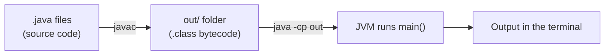
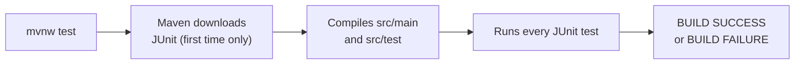
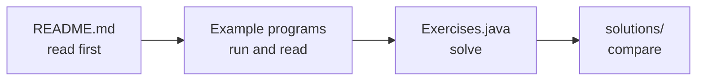
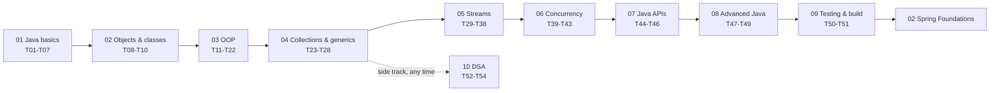

# 01 · Core Java

A step-by-step Core Java course in code: **54 topics in 10 modules**, from your first program to threads, design patterns, JUnit and DSA - each with runnable examples, exercises and solutions.

---

## 📌 Overview

**What is this?**
This folder is a learning path for Core Java. It is not one application - it is a set of small, runnable programs, arranged in the order you should study them.

**What problem does it solve?**
Most beginners don't know *what to study next*, and jump between random tutorials. Here, topic N+1 only uses what topics 1 to N already taught. You never meet a concept before it has been explained.

**Who can use it?**
- College students learning Java for the first time
- Freshers preparing for interviews
- Developers switching to Java from another language
- Anyone who wants to revise Core Java before learning Spring

**How does it work?**
Every topic has:
1. a **README** that explains *why* the topic matters,
2. **example programs** you run and read,
3. an **`Exercises.java`** file you complete yourself, which checks your answers automatically,
4. a **`solutions/`** folder with the answers.

All code comments are written in simple English with everyday Indian examples (UPI, railway counters, Swiggy orders, cricket scores), so the code is easy to follow.

**Next stage:** [02 Spring Foundations](../02-spring-foundations/), where Spring does the object wiring that you do by hand here.

---

## 🎯 Features

- 54 topics in 10 modules, in a fixed study order
- Every topic folder has its own `README.md` (why it matters, key concepts, common mistakes, revision checklist)
- Small example programs - each one starts with a header comment: **Topic, Key idea, Run, Try this**
- Self-checking exercises: `Exercises.java` tells you which exercise is still wrong, and prints `All exercises pass` when you are done
- Reference solutions for every exercise, with comments explaining *why* they work
- Some examples check themselves with `assert` (run them with `-ea`)
- A real Maven + JUnit 5 project (module 09) to learn testing and builds
- A DSA side track (module 10) with LeetCode-style problems for interviews
- No external libraries for modules 01-08 and 10 - only the JDK

---

## 🛠️ Tech Stack

| Technology | Version | Purpose |
|---|---|---|
| Java (JDK) | 21 | The language and compiler for every module |
| JUnit 5 (Jupiter) | 5.13.4 | Unit testing, in module 09 only |
| Maven (via Maven Wrapper) | 3.9.12 | Build and test tool, in module 09 only |
| Git | any recent | To download (clone) the project |

> **Note:** There is **no database, no Spring, no Docker and no frontend** in this folder. Those come in later stages of the repository.

---

## 🏗️ Project Architecture

This folder is a **course**, not a server application. So there are no layers like "controller → service → database". Instead, there are two simple ways code gets run.

### 1. Modules 01-08 and 10 (plain Java, no build tool)

You compile the `.java` files yourself with `javac`, and run one class at a time with `java`.



- **javac** = the Java compiler. It turns `.java` (code you write) into `.class` (bytecode the JVM understands).
- **JVM** = Java Virtual Machine. The program that actually runs your bytecode.
- **`-cp out`** = "classpath": tells `java` which folder to look in for `.class` files.

### 2. Module 09 (a Maven project)

Maven compiles the code, downloads JUnit, and runs the tests for you.



### How one topic is organised



### The study path



| Module | Level | Topics | Why it comes here |
|---|---|---|---|
| [01 Java basics](./01-java-basics/) | Beginner | 01 First program · 02 Variables and data types · 03 Operators · 04 Control flow · 05 Strings · 06 Arrays · 07 Methods | the pieces every later line of code is built from |
| [02 Objects and classes](./02-objects-and-classes/) | Beginner | 08 Classes and objects · 09 static and final · 10 Exception basics | from instructions to things that keep their own state |
| [03 OOP](./03-oop/) | Intermediate | 11 Encapsulation · 12 Inheritance and polymorphism · 13 Abstract classes · 14 Interfaces and DI · 15 equals/hashCode · 16 Enums · 17 Records and immutability · 18 Custom exceptions · 19 Nested classes · 20 Lambdas · 21 Built-in functional interfaces · 22 Method references | designing objects well, then lambdas as the bridge to streams |
| [04 Collections and generics](./04-collections-and-generics/) | Intermediate | 23 Lists · 24 Generics · 25 Sets · 26 Maps and hashing · 27 Queues and deques · 28 Sorting | storing data the right way (needs equals/hashCode and lambdas) |
| [05 Streams](./05-streams/) | Intermediate | 29 Structured vs functional · 30 Intermediate operations · 31 Terminal operations · 32 Collectors · 33 flatMap · 34 Creating streams · 35 Optional · 36 Laziness · 37 Higher-order functions · 38 Capstone | processing collections declaratively |
| [06 Concurrency](./06-concurrency/) | Advanced | 39 Threads · 40 Synchronization · 41 Executors · 42 Parallel streams · 43 CompletableFuture | doing several things at once, safely (needs streams for 42) |
| [07 Java APIs](./07-java-apis/) | Intermediate | 44 File I/O · 45 Date and time · 46 Sockets | files, dates and the network (46 needs threads) |
| [08 Advanced Java](./08-advanced-java/) | Advanced | 47 Modern Java · 48 JVM memory · 49 Design patterns | understanding the Java you read, and the patterns Spring is built on |
| [09 Testing and build](./09-testing-and-build/) | Intermediate | 50 Unit testing with JUnit 5 · 51 Maven | how every project in stages 02-06 is tested and built |
| [10 DSA](./10-dsa/) | Intermediate | 52 Complexity and Big-O · 53 Arrays and hashing · 54 Linked lists and two pointers | a side track for interviews, any time after module 04 |

> **Note:** Topic 50 (unit testing) only needs module 02, so you can take it early and test your own exercise solutions properly.

---

## 📁 Project Structure

```text
01-core-java/
├── README.md                          ← this file
├── 01-java-basics/                    ← module 01 (one folder per module)
│   ├── README.md                      ← module overview and checklist
│   ├── topic01_first_program/         ← one folder per topic
│   │   ├── README.md                  ← read this first
│   │   ├── HelloWorld.java            ← example programs
│   │   ├── CompileVsRuntimeErrors.java
│   │   ├── Exercises.java             ← you complete this
│   │   └── solutions/
│   │       └── ExercisesSolution.java ← reference answers
│   ├── topic02_variables_and_data_types/
│   └── ...
├── 02-objects-and-classes/
├── 03-oop/
├── 04-collections-and-generics/
├── 05-streams/
├── 06-concurrency/
├── 07-java-apis/
├── 08-advanced-java/
├── 09-testing-and-build/              ← the only Maven project
│   ├── pom.xml                        ← Maven build file (Java 21, JUnit 5)
│   ├── mvnw, mvnw.cmd                 ← Maven Wrapper (no Maven install needed)
│   ├── src/main/java/                 ← code under test
│   ├── src/test/java/                 ← JUnit tests
│   ├── topic50_unit_testing/          ← topic README
│   └── topic51_maven/                 ← topic README
└── 10-dsa/
```

**Important files and folders:**
- **Module folder** (for example `01-java-basics`): the folder you compile from. All topics inside it are compiled together.
- **Topic folder** (for example `topic04_control_flow`): also the Java **package** name. That is why you run a class as `topic04_control_flow.LoopTypes`, not just `LoopTypes`.
- **`Exercises.java`**: method stubs that throw `UnsupportedOperationException("TODO ...")`. Replace them with your code.
- **`solutions/ExercisesSolution.java`**: the same checks, with working answers.
- **`out/`**: created by you when you compile (it is not in git). It holds only `.class` files, and `.class` files are ignored by git.

---

## ✅ Prerequisites

| Tool | Version | Why it is needed | Required? |
|---|---|---|---|
| JDK (Java Development Kit) | **21** | Compiles (`javac`) and runs (`java`) every program | Yes |
| Git | any recent | Downloads the project from GitHub | Yes (or download the ZIP) |
| A terminal | PowerShell or Git Bash | To type the commands | Yes |
| Internet | - | Only for module 09, the first time (to download Maven and JUnit) | Module 09 only |
| An IDE (IntelliJ IDEA or Eclipse) | any recent | Easier editing and running | Optional |

> **Important:** Use **JDK 21** (or newer). The code uses Java 21 features such as pattern matching in `switch` and `ExecutorService` in try-with-resources. Older Java versions will fail to compile it.

### Check Java

**Where:** any terminal (PowerShell, Command Prompt or Git Bash).

```bash
java -version
javac -version
```

**Expected result** (the exact numbers may differ, but it must start with 21 or higher):

```text
java version "21.0.7" 2025-04-15 LTS
javac 21.0.7
```

- If you see `'java' is not recognized...`, Java is not installed or not on your `PATH`. See [Common Problems](#-common-problems--solutions).
- If `java -version` shows 21 but `javac -version` fails, you installed only a JRE, not the JDK. Install the **JDK**.

**Don't have JDK 21?** Download it from [Eclipse Temurin (Adoptium)](https://adoptium.net/) or [Oracle](https://www.oracle.com/java/technologies/downloads/), and run the Windows installer. During installation, choose the option to **set `JAVA_HOME`** and **add to `PATH`** if it is offered. Then **close and reopen** your terminal and check again.

### Check Git

```bash
git --version
```

**Expected result:** something like `git version 2.45.1.windows.1`. If it is not found, install it from [git-scm.com](https://git-scm.com/). The Windows installer also gives you **Git Bash**.

---

## 🚀 Installation

### Step 1: Clone the repository

**Where:** a terminal, in the folder where you keep your projects (for example `C:\Users\<you>\projects`).

```bash
git clone https://github.com/adityachauhan564/spring-framework.git
cd spring-framework/01-core-java
```

- `git clone ...` downloads the whole repository into a new folder called `spring-framework`.
- `cd spring-framework/01-core-java` moves you into this Core Java folder.

**Expected result:** `ls` (or `dir`) shows the folders `01-java-basics`, `02-objects-and-classes`, ... `10-dsa`.

### Step 2: Configure environment variables

**Not needed for this folder.** There is no database, API key or secret anywhere in `01-core-java`.

The only "environment" setting that matters is that `java` and `javac` work in your terminal (see [Prerequisites](#-prerequisites)). For module 09, the Maven Wrapper also needs `JAVA_HOME` set, or `java` on your `PATH`.

### Step 3: Install dependencies

- **Modules 01-08 and 10:** nothing to install. They use only the JDK.
- **Module 09:** nothing to install by hand either. The first time you run `mvnw`, it downloads Maven 3.9.12 and JUnit 5.13.4 automatically (this needs internet, and takes a minute).

### Step 4: Start required services

**None.** No MySQL, Docker, Redis or Kafka is needed for Core Java.

> **Note:** Topic 46 (sockets) starts its own small server on your computer, inside the Java program itself. You don't install anything for it.

---

## ▶️ How to Run the Project

You always work **one module at a time**: compile the whole module once, then run any class in it.

### Option A: PowerShell (Windows default)

**Where:** PowerShell, inside a module folder.

```powershell
cd 01-java-basics
javac -d out (Get-ChildItem -Recurse -Filter *.java).FullName
java -cp out topic04_control_flow.LoopTypes
```

What each line does:
1. `cd 01-java-basics` - go into the module folder.
2. `javac -d out (...)` - find every `.java` file in this module and compile them all. `-d out` puts the `.class` files into a folder called `out`.
3. `java -cp out topic04_control_flow.LoopTypes` - run the `LoopTypes` class from the `topic04_control_flow` package.

**Expected result:** step 2 prints nothing (silence means success). Step 3 prints lines such as `for 1..5:        1 2 3 4 5`.

### Option B: Git Bash

**Where:** Git Bash, inside a module folder.

```bash
cd 01-java-basics
javac -d out $(find . -name "*.java")
java -cp out topic04_control_flow.LoopTypes
```

Same three steps. Only the "find every `.java` file" part is written differently.

> **Important:** Don't mix the two. The `$(find ...)` form works **only in Git Bash**. In PowerShell, `find` is a different Windows tool, and you will see `File not found - *.java`.

### Running examples, exercises and solutions

After compiling a module, from the same module folder:

```bash
java -cp out topic04_control_flow.GradeCalculator               # an example program
java -cp out topic04_control_flow.Exercises                     # your exercises
java -cp out topic04_control_flow.solutions.ExercisesSolution   # the answers
```

The pattern is always `java -cp out <topic folder>.<ClassName>`. Every example's header comment shows its exact `Run` command.

**Examples that check themselves:** some programs use `assert`. Add `-ea` ("enable assertions"), or the checks are silently skipped:

```bash
java -ea -cp out topic26_maps_and_hashing.MyHashMap
```

(run from the `04-collections-and-generics` folder). The header comment says when `-ea` is needed.

> **Note:** After you edit a `.java` file, **compile again** before running. `java` runs the old `.class` file otherwise.

### Running module 09 (Maven)

**Where:** inside `09-testing-and-build`.

```powershell
cd 09-testing-and-build
.\mvnw.cmd test        # PowerShell / Command Prompt
```

```bash
./mvnw test            # Git Bash
```

`mvnw` is the **Maven Wrapper**: a small script that downloads the correct Maven version for you, so you don't need to install Maven yourself. See [Running Tests](#-running-tests) for what to expect.

To build and run the jar from topic 51:

```bash
./mvnw package                                  # compiles, runs all tests, then builds the jar
java -jar target/testing-and-build-1.0.0.jar    # runs topic51_maven.App
```

**Expected result:** `Hello from a jar built by Maven`, followed by your Java version.

### Using an IDE instead

- **Modules 01-08 and 10:** create a Java project on each **module folder** (for example `01-core-java/03-oop`), with the module folder itself as the source folder. Then right-click any class → Run.
- **Module 09:** import it as an existing **Maven** project (open the `pom.xml`).

### Backend / Frontend / Database / Docker

Not applicable. This folder has no backend server, no frontend, no database and no Docker setup.

---

## 🧪 Running Tests

There are two kinds of checks in this folder.

### 1. Exercise checks (modules 01-08 and 10)

Each `Exercises.java` has a `main` method that checks your answers one by one.

```bash
java -cp out topic04_control_flow.Exercises
```

| What you see | What it means |
|---|---|
| `UnsupportedOperationException: TODO exercise 1` | Exercise 1 is not written yet. **This is normal before you start.** |
| `AssertionError: exercise 2 gives the wrong answer` | Exercise 2 is written but gives a wrong result. Fix it. |
| `All exercises pass` | You are done with this topic. |

To confirm the checks themselves are correct, run the solution - it always prints `All exercises pass`:

```bash
java -cp out topic04_control_flow.solutions.ExercisesSolution
```

### 2. JUnit tests (module 09)

**Where:** inside `09-testing-and-build`.

```bash
./mvnw test                              # all tests  (PowerShell: .\mvnw.cmd test)
./mvnw test -Dtest=ShoppingCartTest      # only one test class
```

**Expected result:**

```text
Tests run: 21, Failures: 0, Errors: 0, Skipped: 4
BUILD SUCCESS
```

What the tests verify:
- `MyMathsTest` - a first JUnit test: adding numbers, an empty array, negative numbers.
- `ShoppingCartTest` - business rules: an empty cart costs 0, negative prices are refused, the 10% discount starts only *above* 1000.
- `solutions/ExercisesSolutionTest` - the answers to the password-rule exercises.
- `ExercisesTest` - **your** exercises. Its 4 tests are marked `@Disabled`, which is why "Skipped: 4" appears. Remove `@Disabled` one by one as you write each test.

> **Note:** There are no integration tests or frontend tests in this folder.

---

## 🔌 API Documentation

Not applicable. This folder has no REST APIs, so there is no Swagger, OpenAPI or Postman collection. REST APIs start in [03 Spring Boot](../03-spring-boot/).

---

## 💻 Example Usage

A complete first session, in PowerShell, starting from the `01-core-java` folder:

1. **Go to module 01 and compile it.**
   ```powershell
   cd 01-java-basics
   javac -d out (Get-ChildItem -Recurse -Filter *.java).FullName
   ```
2. **Read the topic README:** open `topic01_first_program/README.md`.
3. **Run the first example.**
   ```powershell
   java -cp out topic01_first_program.HelloWorld
   ```
   Output starts with `Hello, World!`.
4. **Run the exercises (before solving).**
   ```powershell
   java -cp out topic01_first_program.Exercises
   ```
   You see `UnsupportedOperationException: TODO exercise 1` - expected.
5. **Solve exercise 1.** Open `topic01_first_program/Exercises.java`, find `nameCard(...)`, and replace the `throw new UnsupportedOperationException(...)` line with your code.
6. **Compile again and re-run** steps 1 and 4. Repeat until you see `All exercises pass`.
7. **Compare** your code with `topic01_first_program/solutions/ExercisesSolution.java`.
8. **Move on** to `topic02_variables_and_data_types`. When module 01 is finished, go to `../02-objects-and-classes`.

---

## ⚙️ Configuration

There are no environment variables or configuration files to set in this folder.

The only settings that exist are in `09-testing-and-build/pom.xml`:

| Setting | Value | Meaning |
|---|---|---|
| `maven.compiler.release` | `21` | Compile for Java 21 |
| `project.build.sourceEncoding` | `UTF-8` | Read source files as UTF-8 |
| `junit-bom` version | `5.13.4` | Fixes the version of all JUnit modules |

You normally don't need to change these.

---

## 🐳 Docker

Not used in this folder. Docker appears later in the repository, only for optional Redis and Kafka setups in `05-applications`.

---

## 🐛 Common Problems & Solutions

### `'javac' is not recognized as an internal or external command`

**Why:** the JDK is not installed, or its `bin` folder is not on your `PATH`.

**Fix:**
1. Install **JDK 21** (see [Prerequisites](#-prerequisites)).
2. Open *Start → "Edit the system environment variables" → Environment Variables*.
3. Set `JAVA_HOME` to your JDK folder, for example `C:\Program Files\Java\jdk-21`.
4. Add `%JAVA_HOME%\bin` to the `Path` variable.
5. **Close and reopen** the terminal, then check with `javac -version`.

### `Error: Could not find or load main class LoopTypes`

**Why:** usually one of these three:
- You left out the package. Use `topic04_control_flow.LoopTypes`, not `LoopTypes`.
- You are in the wrong folder. Run `java` from the **module folder** (for example `01-java-basics`), the same place where `out` was created.
- You haven't compiled yet, or you compiled a different module.

**Fix:** `cd` into the module folder, compile, and run with the full `package.ClassName`.

### `File not found - *.java` (in PowerShell)

**Why:** you typed the Git Bash command `$(find . -name "*.java")` in PowerShell. In PowerShell, `find` is a different Windows program.

**Fix:** use the PowerShell form:
```powershell
javac -d out (Get-ChildItem -Recurse -Filter *.java).FullName
```

### `UnsupportedOperationException: TODO exercise 1`

**Why:** this is **not a bug**. The exercise is waiting for your code.

**Fix:** open that topic's `Exercises.java`, write the method, compile and run again.

### Compile errors such as `switch` patterns or `record` "not supported"

**Why:** you are compiling with an older JDK (for example Java 8 or 11).

**Fix:** check `javac -version`. It must be 21 or higher. If you have several JDKs, make sure `JAVA_HOME` and `Path` point to JDK 21, and reopen the terminal.

### `UnsupportedClassVersionError ... class file version 65.0`

**Why:** the code was compiled with Java 21, but you are *running* it with an older `java`.

**Fix:** make sure `java -version` and `javac -version` both show 21.

### I changed the code but the output didn't change

**Why:** you ran the old `.class` file.

**Fix:** compile again (the `javac` command) before every `java` run.

### My `assert` checks don't run

**Why:** Java turns assertions **off** by default.

**Fix:** add `-ea`: `java -ea -cp out topic15_equals_and_hashcode.EqualsAndHashCode`.

### `.\mvnw.cmd` fails with a `JAVA_HOME` error

**Why:** the Maven Wrapper could not find your JDK.

**Fix:** set `JAVA_HOME` to your JDK 21 folder (see the first problem above), reopen the terminal, and try again.

### `mvnw` fails while downloading the first time

**Why:** the first run downloads Maven and JUnit from the internet.

**Fix:** check your internet connection (office proxies and firewalls can block it), then run the command again. After the first successful run it works offline.

### Topic 46: `BindException: Address already in use`

**Why:** `Server` uses port **8010**, and something else - often an earlier copy of the same server - is already using it.

**Fix:** stop the old server with `Ctrl + C` in its terminal. To find what is using the port:
```powershell
netstat -ano | findstr :8010
```
The last number is the process ID. You can close it in Task Manager. (`SocketDemo` doesn't have this problem - it asks Windows for any free port.)

### A timing exercise fails on a slow computer

**Why:** a few concurrency exercises (topics 41 and 43) also check that your code runs in parallel, using a time limit. A very busy computer can sometimes miss it.

**Fix:** close heavy programs and run again. If it still fails, your code is probably running the tasks one after another - check that you start all of them before waiting for any.

---

## 🔐 Security Notes

This folder has no passwords, keys or secrets, and needs none. Still, build good habits now - they matter from stage 02 onwards:
- Never commit a `.env` file or any file with real passwords.
- Never write passwords or API keys directly in code. Read them from environment variables.
- Never put production credentials on GitHub, even in a private repository.
- If you commit a secret by mistake, deleting the file is not enough - the secret is still in git history. Change (rotate) the secret.

---

## 📊 Testing / Quality

What exists today:
- **Self-checking exercises** in every topic (`Exercises.java` + `solutions/`).
- **`assert`-based checks** inside several examples (run with `-ea`).
- **JUnit 5 tests** in module 09: 21 tests, run with `./mvnw test`.

What does **not** exist in this folder: code-coverage reports, static analysis (for example SonarQube or Checkstyle), linting, or a CI pipeline.

---

## 🚀 Deployment

Not applicable. These are learning programs that run on your own computer. Nothing here is meant to be deployed to a server.

The closest thing is topic 51, which packages module 09 as a runnable jar (`./mvnw package`, then `java -jar target/testing-and-build-1.0.0.jar`).

---

## 📚 Learning Guide

Follow the modules in order. Each step uses only what came before it.

```text
Java basics (01)
   ↓
Objects and classes (02)
   ↓
OOP (03)  ──────────────┐
   ↓                    │
Collections (04) ───→ DSA (10, side track, any time)
   ↓
Streams (05)
   ↓
Concurrency (06)
   ↓
Java APIs (07)
   ↓
Advanced Java (08)
   ↓
Testing and build (09)
   ↓
Next stage: 02 Spring Foundations
```

- **Java basics** - variables, loops, strings, arrays and methods are in every line of code you'll ever write.
- **Objects and classes** - Java programs are built from objects. Everything after this uses them.
- **OOP** - encapsulation, interfaces and dependency injection are exactly the ideas Spring is built on (topic 14 does by hand what Spring automates).
- **Collections** - every real program stores data in lists, sets and maps. Also the most-asked interview area.
- **Streams** - modern Java code (and Spring code) processes collections with streams and lambdas.
- **Concurrency** - web servers handle many users at the same time. You need to know what can go wrong.
- **Java APIs** - files, dates and networking come up in almost every project.
- **Advanced Java** - modern syntax, JVM memory and design patterns help you read real-world code.
- **Testing and build** - every project in stages 02-06 is built with Maven and tested with JUnit.
- **DSA** - Big-O and classic problem patterns for coding interviews.

### Quick revision checklist

Each item links to the topic that teaches it. Every module README has a longer checklist.
- [ ] Compile and run from the terminal, and read compile and runtime errors ([01](./01-java-basics/topic01_first_program/))
- [ ] Types, casting, and why `Integer == Integer` can be false ([02](./01-java-basics/topic02_variables_and_data_types/))
- [ ] String immutability and `equals` ([05](./01-java-basics/topic05_strings/)); pass-by-value ([07](./01-java-basics/topic07_methods/))
- [ ] Classes, static vs instance, checked vs unchecked exceptions ([08](./02-objects-and-classes/topic08_classes_and_objects/)-[10](./02-objects-and-classes/topic10_exception_basics/))
- [ ] Encapsulation, polymorphism, abstract classes vs interfaces ([11](./03-oop/topic11_encapsulation_and_access_modifiers/)-[13](./03-oop/topic13_abstract_classes/))
- [ ] Dependency injection by hand, the idea Spring automates ([14](./03-oop/topic14_interfaces_and_dependency_injection/))
- [ ] The `equals`/`hashCode` contract, records, immutability ([15](./03-oop/topic15_equals_and_hashcode/), [17](./03-oop/topic17_records_and_immutability/))
- [ ] Lambdas, functional interfaces, method references ([20](./03-oop/topic20_lambdas_and_functional_interfaces/)-[22](./03-oop/topic22_method_references/))
- [ ] Choosing a collection, and how a HashMap works ([23](./04-collections-and-generics/topic23_lists_and_iteration/)-[27](./04-collections-and-generics/topic27_queues_and_deques/))
- [ ] Comparable vs Comparator ([28](./04-collections-and-generics/topic28_sorting/))
- [ ] Stream pipelines, collectors, `Optional`, laziness ([29](./05-streams/topic29_structured_vs_functional/)-[38](./05-streams/topic38_streams_capstone/))
- [ ] Race conditions, deadlock, thread pools, `CompletableFuture` ([39](./06-concurrency/topic39_threads/)-[43](./06-concurrency/topic43_completable_future_and_concurrent_collections/))
- [ ] Files, `java.time`, sockets ([44](./07-java-apis/topic44_file_io/)-[46](./07-java-apis/topic46_sockets/))
- [ ] Sealed types and pattern matching, the stack and the heap, design patterns ([47](./08-advanced-java/topic47_modern_java/)-[49](./08-advanced-java/topic49_design_patterns/))
- [ ] JUnit tests and a Maven build ([50](./09-testing-and-build/topic50_unit_testing/), [51](./09-testing-and-build/topic51_maven/))
- [ ] Big-O, and the classic array and linked-list patterns ([52](./10-dsa/topic52_complexity/)-[54](./10-dsa/topic54_linked_lists_and_two_pointers/))

---

## ❓ FAQ

**What is this folder?**
A Core Java course made of small runnable programs: 54 topics, each with examples, exercises and solutions.

**Which Java version do I need?**
JDK 21 or newer. Check with `javac -version`.

**Do I need Maven?**
Only for module 09, and you don't install it - `mvnw` downloads it for you.

**Do I need Docker or a database?**
No. Nothing in `01-core-java` uses Docker or a database.

**Where do I start?**
[`01-java-basics/topic01_first_program/README.md`](./01-java-basics/topic01_first_program/).

**Do I have to follow the order?**
Yes, for modules 01-09 - each topic uses earlier ones. Module 10 (DSA) can be done any time after module 04, and topic 50 any time after module 02.

**How do I know my exercise answer is right?**
Run `Exercises`. It prints `All exercises pass` when every answer is correct.

**Can I use IntelliJ or Eclipse?**
Yes. See [Using an IDE instead](#using-an-ide-instead).

**How do I run the tests?**
Exercises: `java -cp out <topic>.Exercises`. JUnit: `./mvnw test` inside `09-testing-and-build`.

**Where is the API documentation?**
There are no APIs in this folder. They start in [03 Spring Boot](../03-spring-boot/).

---

## 🤝 Contributing

Found a mistake, or have a clearer example? Contributions are welcome.

1. **Fork** the repository on GitHub (the *Fork* button, top right).
2. **Clone your fork** and create a branch:
   ```bash
   git checkout -b docs/clearer-streams-example
   ```
3. **Make your change.** Keep it small and focused on one topic.
4. **Run the checks** for the module you changed:
   - compile the module, then run the topic's examples and `solutions.ExercisesSolution` (it must print `All exercises pass`);
   - make sure `Exercises` still stops at its first unsolved exercise;
   - for module 09, run `./mvnw test`.
5. **Commit** with a clear message (see the guidelines below).
6. **Push** your branch and open a **Pull Request** on GitHub, explaining what you changed and why.

---

## 📝 Development Guidelines

These are the conventions already used in this folder:

- **Folder and package names:** `topicNN_short_name` (for example `topic26_maps_and_hashing`). The folder name *is* the package name.
- **Every topic has:** `README.md`, example programs, `Exercises.java`, and `solutions/ExercisesSolution.java`.
- **Example header comment:** starts with `Topic`, `Key idea`, `Run`, and optionally `Try this` / `Next`.
- **Exercises:** unsolved methods throw `UnsupportedOperationException("TODO exercise N")`; `main` checks the answers and ends with `All exercises pass`.
- **Comments:** simple English, short sentences, an everyday example where it helps.
- **Order matters:** a topic may only use what earlier topics have taught.
- **Dependencies:** modules 01-08 and 10 use only the JDK. Don't add libraries to them.
- **Commit messages:** Conventional Commits style, for example `docs(core-java): ...`, `fix(core-java): ...`, `refactor(core-java): ...`.
- **Branch names:** a type prefix, for example `docs/...`, `fix/...`, `refactor/...`.
- **Pull requests:** one clear purpose, and mention how you checked it.

---

## 📄 License

TODO: no license file has been added to this repository yet. Until one is added, please ask the author before reusing the code.

**Where the code came from:**
- *Head First Java* examples and interview questions (modules 01-08)
- the in28minutes *Functional Programming with Java* course (module 05, topics 20-22 and 42)
- in28minutes *JUnit in 5 steps* (topic 50)
- a "build a multithreaded web server" tutorial (topic 46)
- *Cracking the Coding Interview* and LeetCode problems (module 10)

---

## 👨‍💻 Author

**Aditya R. Chauhan** - GitHub: [@adityachauhan564](https://github.com/adityachauhan564)
