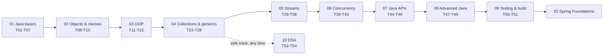

# 01 · Core Java

**Goal:** go from your first program to advanced Java without guessing what to study next. There are **54 topics in 10 modules**, and topic N+1 only uses what topics 1 to N taught. Next stage: [02 Spring Foundations](../02-spring-foundations/), where a container does the object wiring you do by hand here.

## The path



| Module | Level | Topics | Why it comes here |
|---|---|---|---|
| [01 Java basics](./01-java-basics/) | Beginner | 01 First program · 02 Variables and data types · 03 Operators · 04 Control flow · 05 Strings · 06 Arrays · 07 Methods | the pieces every later line of code is built from |
| [02 Objects and classes](./02-objects-and-classes/) | Beginner | 08 Classes and objects · 09 static and final · 10 Exception basics | from instructions to things that keep their own state |
| [03 OOP](./03-oop/) | Intermediate | 11 Encapsulation · 12 Inheritance and polymorphism · 13 Abstract classes · 14 Interfaces and DI · 15 equals/hashCode · 16 Enums · 17 Records and immutability · 18 Custom exceptions · 19 Nested classes · 20 Lambdas · 21 Built-in functional interfaces · 22 Method references | designing objects well, then lambdas as the bridge to streams |
| [04 Collections and generics](./04-collections-and-generics/) | Intermediate | 23 Lists · 24 Generics · 25 Sets · 26 Maps and hashing · 27 Queues and deques · 28 Sorting | storing data the right way (needs equals/hashCode and lambdas) |
| [05 Streams](./05-streams/) | Intermediate | 29 Structured vs functional · 30 Intermediate operations · 31 Terminal operations · 32 Collectors · 33 flatMap · 34 Creating streams · 35 Optional · 36 Laziness · 37 Higher-order functions · 38 Capstone | processing collections declaratively |
| [06 Concurrency](./06-concurrency/) | Advanced | 39 Threads · 40 Synchronization · 41 Executors · 42 Parallel streams · 43 CompletableFuture | doing several things at once, safely (needs streams for 42) |
| [07 Java APIs](./07-java-apis/) | Intermediate | 44 File I/O · 45 Date and time · 46 Sockets | files, dates and the network (46 needs threads) |
| [08 Advanced Java](./08-advanced-java/) | Advanced | 47 Modern Java · 48 JVM memory · 49 Design patterns | understanding the Java you read, and the patterns Spring is built on |
| [09 Testing and build](./09-testing-and-build/) | Intermediate | 50 Unit testing with JUnit 5 · 51 Maven | how every project in stages 02-06 is tested and built |
| [10 DSA](./10-dsa/) | Intermediate | 52 Complexity and Big-O · 53 Arrays and hashing · 54 Linked lists and two pointers | a side track for interviews, any time after module 04 |

Topic 50 (unit testing) only needs module 02, so you can take it early and test your exercise solutions properly.

## How every topic works
Each topic is one folder with the same parts:
1. **`README.md`:** why it matters (read this first), what you'll learn, how to run it, key concepts, exercises, common mistakes, related topics, and a revision checklist.
2. **Examples:** small, runnable programs. Each starts with a header comment: **Topic, Key idea, Run, Try this**. Predict the output, run it, then read the code.
3. **`Exercises.java`:** method stubs that throw `TODO`. Fill them in until the program prints "All exercises pass".
4. **`solutions/`:** the reference answers, with comments on why they work.

## Compile and run
Modules 01-08 and 10 need only the JDK (21), with no build file. From a module folder:
```bash
cd 01-core-java/01-java-basics
javac -d out $(find . -name "*.java")              # PowerShell: javac -d out (Get-ChildItem -Recurse -Filter *.java).FullName
java -cp out topic04_control_flow.LoopTypes         # any topicNN_<name>.<Class>
java -cp out topic04_control_flow.Exercises
```
Add `-ea` for examples that check themselves with `assert` (their header says so). Module 09 is a Maven project: `cd 09-testing-and-build && ./mvnw test`.

In an IDE, open each module folder as its own project with the folder as the source folder. Import module 09 as a Maven project.

## Where the code came from
- *Head First Java* examples and interview questions (modules 01-08)
- the in28minutes *Functional Programming with Java* course (module 05, topics 20-22 and 42)
- in28minutes *JUnit in 5 steps* (topic 50)
- a "build a multithreaded web server" tutorial (topic 46)
- *Cracking the Coding Interview* and LeetCode problems (module 10)

## Stage checklist
Each item links to the topic that teaches it. Every module README has a longer checklist.
- [ ] Compile and run from the terminal, and read compile and runtime errors ([01](./01-java-basics/topic01_first_program/))
- [ ] Types, casting, and why `Integer == Integer` can be false ([02](./01-java-basics/topic02_variables_and_data_types/))
- [ ] String immutability and `equals` ([05](./01-java-basics/topic05_strings/)); pass-by-value ([07](./01-java-basics/topic07_methods/))
- [ ] Classes, static vs instance, checked vs unchecked exceptions ([08](./02-objects-and-classes/topic08_classes_and_objects/)-[10](./02-objects-and-classes/topic10_exception_basics/))
- [ ] Encapsulation, polymorphism, abstract classes vs interfaces ([11](./03-oop/topic11_encapsulation_and_access_modifiers/)-[13](./03-oop/topic13_abstract_classes/))
- [ ] Dependency injection by hand, the idea Spring automates ([14](./03-oop/topic14_interfaces_and_dependency_injection/))
- [ ] The `equals`/`hashCode` contract, records, immutability ([15](./03-oop/topic15_equals_and_hashcode/), [17](./03-oop/topic17_records_and_immutability/))
- [ ] Lambdas, functional interfaces, method references ([20](./03-oop/topic20_lambdas_and_functional_interfaces/)-[22](./03-oop/topic22_method_references/))
- [ ] Choosing a collection, and how a HashMap works ([23](./04-collections-and-generics/topic23_lists_and_iteration/)-[27](./04-collections-and-generics/topic27_queues_and_deques/))
- [ ] Comparable vs Comparator ([28](./04-collections-and-generics/topic28_sorting/))
- [ ] Stream pipelines, collectors, `Optional`, laziness ([29](./05-streams/topic29_structured_vs_functional/)-[38](./05-streams/topic38_streams_capstone/))
- [ ] Race conditions, deadlock, thread pools, `CompletableFuture` ([39](./06-concurrency/topic39_threads/)-[43](./06-concurrency/topic43_completable_future_and_concurrent_collections/))
- [ ] Files, `java.time`, sockets ([44](./07-java-apis/topic44_file_io/)-[46](./07-java-apis/topic46_sockets/))
- [ ] Sealed types and pattern matching, the stack and the heap, design patterns ([47](./08-advanced-java/topic47_modern_java/)-[49](./08-advanced-java/topic49_design_patterns/))
- [ ] JUnit tests and a Maven build ([50](./09-testing-and-build/topic50_unit_testing/), [51](./09-testing-and-build/topic51_maven/))
- [ ] Big-O, and the classic array and linked-list patterns ([52](./10-dsa/topic52_complexity/)-[54](./10-dsa/topic54_linked_lists_and_two_pointers/))
