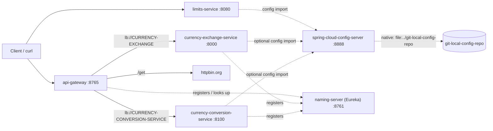

# 04 — Spring Cloud Microservices

My hands-on version of the in28minutes microservices course: centralised config, service discovery, an API gateway and inter-service calls. All services use **Spring Boot 4.0.2 / Spring Cloud 2025.1.0 / Java 21** and each is its own Maven project (`./mvnw spring-boot:run` from its folder). The complete course code lives in [`../reference/in28minutes-spring-microservices-v3`](../reference/in28minutes-spring-microservices-v3).

| # | Project | Topics | Status |
|---|---------|--------|--------|
| 1 | [limits-service](./limits-service) | `@ConfigurationProperties`, config client, profiles | ✅ Working |
| 2 | [spring-cloud-config-server](./spring-cloud-config-server) | `@EnableConfigServer`, native backend | ✅ Working |
| – | [git-local-config-repo](./git-local-config-repo) | the property files served (default / dev / qa) | data |
| 3 | [naming-server](./naming-server) | Eureka service registry | ✅ Working |
| 4 | [currency-exchange-service](./currency-exchange-service) | JPA + H2, Eureka client, Resilience4j | 📝 Skeleton (controller/entity not committed) |
| 5 | [currency-conversion-service](./currency-conversion-service) | OpenFeign, Eureka client | 📝 Skeleton (Feign proxy/controller not committed) |
| 6 | [api-gateway](./api-gateway) | Spring Cloud Gateway routes, `lb://`, global filter | ✅ Working |

## How they connect
Solid lines are HTTP calls that exist in code or config. Dotted lines are config or registration.



In the course, conversion → exchange is a Feign call. It isn't in this repo yet: see the currency-conversion-service README.

## Ports
| Service | `spring.application.name` | Port |
|---|---|---|
| limits-service | `limit-service-microservices` | 8080 |
| spring-cloud-config-server | `spring-cloud-config-server` | 8888 |
| naming-server | `naming-server` | 8761 |
| currency-exchange-service | `currency-exchange` | 8000 |
| currency-conversion-service | `currency-conversion-service` | 8100 |
| api-gateway | `api-gateway` | 8765 |

## Startup order
1. **spring-cloud-config-server**: start it **from its own folder** (`cd spring-cloud-config-server`), because it reads `file:../git-local-config-repo`.
2. **naming-server**: open http://localhost:8761 to watch registrations.
3. **limits-service**, **currency-exchange-service**, **currency-conversion-service**
4. **api-gateway** (last, so it finds the services in Eureka)

## Test URLs
```bash
curl localhost:8888/limit-service-microservices/dev      # config server: raw config
curl localhost:8080/limits                               # {"minimum":5,"maximum":995} with the dev profile
curl localhost:8765/get                                  # gateway -> httpbin, shows the added header and param
# once the currency services are implemented:
curl localhost:8000/currency-exchange/from/USD/to/INR
curl localhost:8100/currency-conversion-feign/from/USD/to/INR/quantity/10
curl localhost:8765/currency-exchange/from/USD/to/INR   # through the gateway
```

## Suggested study order
limits-service → config-server (and config-repo) → naming-server → currency-exchange → currency-conversion → api-gateway. Each step adds one concept on top of the previous one.

## Quick revision checklist
- [ ] How a config client finds its files (`{application}-{profile}.properties`) and which value wins
- [ ] What the `optional:` prefix in `spring.config.import` changes
- [ ] Why the Eureka server sets `register-with-eureka=false`
- [ ] What `lb://SERVICE-NAME` means in a gateway route
- [ ] Feign vs RestTemplate, and what `@FeignClient(name=...)` must match
- [ ] Why `from`/`to` need `@Column` renames in the exchange entity
- [ ] The difference between a `GlobalFilter` and a per-route filter
- [ ] Why services start in the order config → registry → services → gateway
