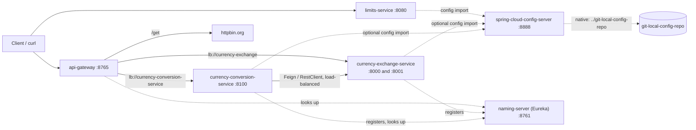

# 04 — Spring Cloud Microservices

> Six small services that together show the core microservice patterns: central config, service discovery, load balancing, service-to-service calls, an API gateway, fault tolerance and distributed tracing.

My hands-on version of the in28minutes microservices course, on **Spring Boot 4.0.2 / Spring Cloud 2025.1.0 / Java 21**. The course's own code is in [`../reference/in28minutes-spring-microservices-v3`](../reference/in28minutes-spring-microservices-v3) for comparison.

**Before this:** [03-spring-boot](../03-spring-boot). Every service here is a normal Boot app; this stage is about how several of them work *together*.

## Why microservices at all?
One big app is simpler, until different parts need to scale, deploy or fail independently. Splitting it creates new problems, and each project here solves one of them:

| Problem once you split an app | Solution | Project |
|---|---|---|
| Every service has its own config files | One **config server** serves them all | [spring-cloud-config-server](./spring-cloud-config-server) + [git-local-config-repo](./git-local-config-repo) |
| Reading that config, and changing it without a restart | Config client + `/actuator/refresh` | [limits-service](./limits-service) |
| Services move and scale; hard-coded host:port breaks | A **registry** (Eureka) where they look each other up by name | [naming-server](./naming-server) |
| A service that others call, running as 2+ instances | Eureka client, JPA, **Resilience4j** retry / circuit breaker / rate limiter | [currency-exchange-service](./currency-exchange-service) |
| Calling another service without writing HTTP plumbing | **Feign** (declarative) vs **RestClient** (by hand), both load-balanced | [currency-conversion-service](./currency-conversion-service) |
| Clients shouldn't know about every service | One **API gateway** in front, with routes and filters | [api-gateway](./api-gateway) |
| One request crosses 3 services: which log lines belong together? | **Tracing**: one trace id in every log line | exchange, conversion, gateway |

## Run the whole system (one command)
Needs only JDK 21.
```bash
./start-all.sh        # Git Bash / macOS / Linux    (Windows PowerShell: .\start-all.ps1)
./stop-all.sh         # stops everything            (.\stop-all.ps1)
```
If PowerShell says "running scripts is disabled", run `powershell -ExecutionPolicy Bypass -File .\start-all.ps1` (this changes nothing permanently).

`start-all` builds all six services, starts them **in the right order**, waits until each is ready and until Eureka lists them (about 45-80 s), then prints URLs to try. If a service doesn't come up, it stops and points you to its log. Logs go to `logs/<service>.log`. It starts currency-exchange **twice** (ports 8000 and 8001) so you can watch load balancing.

Build and test everything without starting it: `./mvnw verify` (14 tests; no service needs another running).

Each service still runs on its own: `cd <service> && ./mvnw spring-boot:run`.

## How they connect
Solid lines are HTTP calls; dotted lines are config or registration.


```mermaid
flowchart LR
    Client["Client / curl"] --> GW["api-gateway :8765"]
    GW -->|"lb://currency-exchange"| EX["currency-exchange-service<br/>:8000 and :8001"]
    GW -->|"lb://currency-conversion-service"| CONV["currency-conversion-service :8100"]
    GW -->|"/get"| HB["httpbin.org"]
    CONV -->|"Feign / RestClient, load-balanced"| EX
    Client --> LIM["limits-service :8080"]
    LIM -.->|"config import"| CFG["spring-cloud-config-server :8888"]
    EX -.->|"optional config import"| CFG
    CONV -.->|"optional config import"| CFG
    CFG -.->|"native: ../git-local-config-repo"| REPO[("git-local-config-repo")]
    GW -.->|"looks up"| EUR["naming-server (Eureka) :8761"]
    EX -.->|"registers"| EUR
    CONV -.->|"registers, looks up"| EUR
```

## Ports
| Service | `spring.application.name` | Port |
|---|---|---|
| spring-cloud-config-server | `spring-cloud-config-server` | 8888 |
| naming-server | `naming-server` | 8761 |
| limits-service | `limit-service-microservices` | 8080 |
| currency-exchange-service | `currency-exchange` | 8000, 8001 |
| currency-conversion-service | `currency-conversion-service` | 8100 |
| api-gateway | `api-gateway` | 8765 |

**Startup order matters:** config server → naming server → services → gateway. A service that starts before the config server falls back to its local values; one that starts before Eureka registers ~30 s late. `start-all` handles this for you.

## Walkthrough: try every pattern (with the system running)
Each step builds on the previous one. Expected output is what I got.

**1. Central config.**
```bash
curl localhost:8888/limit-service-microservices/dev    # the raw config: -dev file first (wins), then the default file
curl localhost:8080/limits                             # {"minimum":5,"maximum":995}
```

**2. Change config without a restart.** Edit `git-local-config-repo/limit-service-microservices-dev.properties` (say `maximum=777`), then:
```bash
curl -X POST localhost:8080/actuator/refresh           # ["limits-service.maximum"]  = the keys that changed
curl localhost:8080/limits                             # {"minimum":5,"maximum":777}
```
Put the value back afterwards.

**3. Discovery and load balancing.** Open http://localhost:8761: CURRENCY-EXCHANGE has 2 instances. Call it twice through the gateway:
```bash
curl localhost:8765/currency-exchange/from/USD/to/INR  # "environment":"8000"
curl localhost:8765/currency-exchange/from/USD/to/INR  # "environment":"8001"
```

**4. Service-to-service calls, two ways.**
```bash
curl localhost:8100/currency-conversion/from/USD/to/INR/quantity/10        # RestClient: totalCalculatedAmount 910, "8000 rest-client"
curl localhost:8100/currency-conversion-feign/from/USD/to/INR/quantity/10  # Feign: same result, "8001 feign"
curl localhost:8100/currency-conversion-feign/from/USD/to/XYZ/quantity/10  # 404 ProblemDetail: the exchange said "unknown pair"
```

**5. Gateway routes and filters.**
```bash
curl localhost:8765/currency-conversion-feign/from/USD/to/INR/quantity/10  # same call, through the gateway
curl localhost:8765/currency-conversion-new/from/USD/to/INR/quantity/10    # a public path rewritten to the Feign one
curl localhost:8765/get                                                    # proxied to httpbin.org: shows the added MyHeader and Param
```

**6. Tracing.** Every log line carries `[service,traceId,spanId]`. Make one call through the gateway, copy the traceId from the last line of `logs/api-gateway.log`, and grep for it:
```bash
grep <traceId> logs/*.log     # the same id in the gateway, conversion AND exchange logs
```

**7. Fault tolerance.** The Resilience4j demo endpoints live on the exchange service (see its README):
```bash
curl localhost:8000/sample-api                       # retried 5 times (watch logs/currency-exchange-8000.log), then the fallback
for i in $(seq 12); do curl -s localhost:8000/sample-api/circuit-breaker; echo; done   # the circuit opens: calls stop reaching the broken URL
for i in 1 2 3; do curl -s localhost:8000/sample-api/rate-limited; echo; done          # 2 allowed, the 3rd is "too many requests"
```

**8. A service dies.** Stop both exchange instances (on Windows: find the PIDs of ports 8000/8001 with `netstat -ano`):
```bash
curl localhost:8100/currency-conversion-feign/from/USD/to/INR/quantity/10  # 503 ProblemDetail from ConversionExceptionHandler
curl localhost:8765/currency-exchange/from/USD/to/INR                      # 500 from the gateway, not 503 - see the api-gateway README
```

### Optional: see traces in Zipkin
The trace ids in the logs are enough to follow a request. To see them as a timeline, add `spring-boot-starter-zipkin` to the three traced services and run Zipkin (`docker run -d -p 9411:9411 openzipkin/zipkin`); Boot sends spans to `localhost:9411` by default. It's left out so the stage runs without Docker.

## Spring Boot 4 / Spring Cloud 2025 notes
Things that differ from the course (Boot 3), all hit while writing this stage:
- Boot 4 split features into separate modules: `RestClient.Builder` needs `spring-boot-starter-restclient`; `@AutoConfigureMockMvc` needs `spring-boot-starter-webmvc-test`; tracing auto-configuration is `spring-boot-micrometer-tracing-brave` (plus the `micrometer-tracing-bridge-brave` tracer itself); the H2 console is `spring-boot-h2console`.
- Resilience4j needs the `resilience4j-spring-boot4` artifact; the `-boot3` one doesn't work on Boot 4.
- Gateway properties moved under `spring.cloud.gateway.server.webflux.*`.
- `RestTemplate` (used in the course) still works but is in maintenance mode; `RestClient` is its replacement.

## Suggested study order
config-server + config-repo → limits-service → naming-server → currency-exchange → currency-conversion → api-gateway. Each step adds one concept to the previous one.

## Quick revision checklist
- [ ] How a config client finds its files (`{application}-{profile}.properties`) and which value wins
- [ ] What `optional:` in `spring.config.import` changes
- [ ] Which beans `/actuator/refresh` updates (`@ConfigurationProperties` yes, plain `@Value` only with `@RefreshScope`)
- [ ] Why the Eureka server sets `register-with-eureka=false`
- [ ] What `lb://service-name` means, and where the name comes from
- [ ] Feign vs RestClient: what each makes you write, and how both get load balancing
- [ ] Why `from`/`to` need `@Column` renames in the exchange entity
- [ ] Retry vs circuit breaker vs rate limiter: which failure each one handles
- [ ] What a trace id and a span id are, and how the id travels between services
- [ ] `GlobalFilter` vs a per-route filter
- [ ] Why the services start in the order config → registry → services → gateway
