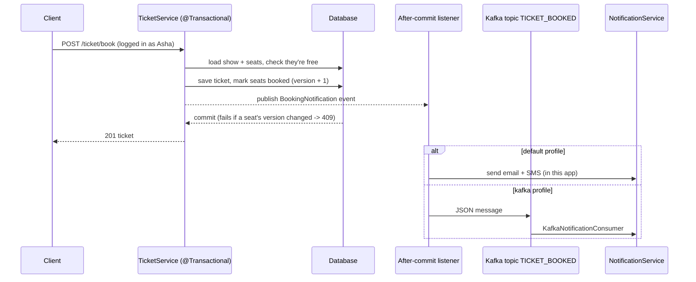

# ShowTime: Movie Ticket Booking Backend

> A Spring Boot backend for movies, theatres, shows, reviews and ticket booking. It has real security (BCrypt and roles), safe booking when many people book at once (transactions and optimistic locking), and booking notifications that run inside the app or through **Kafka**, with email. Built during the GeeksforGeeks JBDL course (package `com.gfg.showtime`).

**Before this:** [digital-library](../digital-library) (relationships, validation, errors). ShowTime adds the problems a real booking system has: who may do what, two people wanting the same seat, and side effects like emails, which must not break a booking or create a second one.

## Why it matters
Booking looks like "mark a seat as taken". Doing it correctly means answering four questions:
- **Who is booking?** Take the user from the login, never from the request body.
- **What if two people click at the same moment?** Only one of them may get the seat. Like two people at a cinema counter pointing at the same seat: only one ticket can be printed.
- **What if something fails halfway?** Either the whole booking is saved, or none of it is.
- **When do we send the email?** Only for bookings that were really saved, and without making the customer wait for the mail server.

## What it teaches
- A booking domain in JPA: Movie → Shows → ShowSeats, Theater → TheaterSeats, User → Tickets
- DTOs (`resource/*` records) kept separate from entities (`domain/*`)
- Spring Security without `WebSecurityConfigurerAdapter`: `SecurityFilterChain`, BCrypt, `UserDetailsService`, role rules, HTTP Basic
- `@Transactional` booking, and `@Version` **optimistic locking** to stop double booking
- Domain events with `@TransactionalEventListener`: act only after the commit
- **Kafka**: producer, topic, consumer group; `@EmbeddedKafka` in tests
- Email with `JavaMailSender`, tested against Mailpit (a fake mail server with a web inbox)
- `ProblemDetail` errors, OpenAPI docs (springdoc)

## Run it (nothing to install except JDK 21)
```bash
./mvnw spring-boot:run        # Windows: mvnw.cmd spring-boot:run
./mvnw test                   # 17 tests (one starts an embedded Kafka broker)
```
It starts on H2 with sample data:
- **Movies:** Inception, 3 Idiots, Interstellar.
- **Shows:** two shows tomorrow at PVR Phoenix, Mumbai.
- **Users:**

  | Login | Password | Role |
  |---|---|---|
  | `admin@showtime.local` | `admin12345` (or `ADMIN_PASSWORD`) | ADMIN |
  | `asha@example.com` | `password123` | USER |

  These are for local demos only.

Swagger UI: http://localhost:8080/swagger-ui.html. For Postman, import `Showtime.postman_collection.json` and run the requests in order. They already carry the logins.

```bash
curl "localhost:8080/show/search?city=Mumbai"                                        # public
curl -u asha@example.com:password123 -X POST localhost:8080/ticket/book \
     -H "Content-Type: application/json" -d '{"showId":1,"seatsNumbers":["1A","1B"],"seatType":"REGULAR"}'
# run the same booking again -> 409 "Seats [...] are not all free"
curl -u asha@example.com:password123 localhost:8080/user/me                          # your tickets
curl -u asha@example.com:password123 -X POST localhost:8080/movie/add \
     -H "Content-Type: application/json" -d '{"title":"X","genre":"DRAMA"}'          # 403: ADMIN only
```
The app log shows the notification: "No mail server configured, email to asha@example.com not sent: ...".

| Endpoint | Who |
| --- | --- |
| `POST /user/signup` | anyone (always role USER) |
| `GET /movie/{id}`, `/movie/title?title=`, `/movie/top?genre=`, `/show/search?city=&movieName=&theaterName=`, `/theater/{id}`, `/review/find?reviewId=` | anyone |
| `POST /movie/add`, `/theater/add`, `/show/add`, `GET /user/{id}` | ADMIN |
| `POST /ticket/book`, `POST /review/add`, `GET /user/me` | any logged-in user |
| `GET /ticket/{id}` | the ticket's owner, or ADMIN |

### Optional: Kafka, real emails, MySQL
```bash
docker compose up -d                                             # Kafka on :9092, Mailpit on :1025 (web inbox :8025)
./mvnw spring-boot:run -Dspring-boot.run.profiles=kafka,mail
# book a ticket (as above), then:
#   the log shows: Published to TICKET_BOOKED -> Received from TICKET_BOOKED -> Email sent to asha@example.com
#   open http://localhost:8025 to read the email
docker compose down

export DB_PASSWORD=...            # PowerShell: $env:DB_PASSWORD="..."; DB_USERNAME defaults to root
./mvnw spring-boot:run -Dspring-boot.run.profiles=mysql
```

## How a booking flows


## Read the code in this order
1. `design.txt`: the original requirements and entities
2. `domain/`: the entities. Start with `Show`, `ShowSeat` (`@Version`) and `Ticket`
3. `resource/`: the request/response records and their validation
4. `service/TicketService.java`: the booking; then `ShowService`, `TheaterService`, `ReviewService`
5. `notification/`: `BookingNotification` → `LocalNotificationListener` or `KafkaNotificationPublisher` → `KafkaNotificationConsumer` → `NotificationService`
6. `config/SecurityConfiguration.java`, `service/UserAuthService.java`, `domain/User.java`: security
7. `exception/ApiExceptionHandler.java`: `ProblemDetail` for every error
8. `config/DataSeeder.java`, `config/KafkaConfig.java`, and the `application-*.properties` files
9. Tests:
   - `BookingTest`: price, notification timing, the race, `@Version`
   - `ApiSecurityTest`: 401/403, signup, ownership, validation, reviews
   - `KafkaNotificationTest`
   - `NotificationServiceTest`
   - `RepositoryQueryTest`

## Revision notes
**Security**
- **Who is the user?** Take it from the login (`@AuthenticationPrincipal`), never from a `userId` in the body. Otherwise anyone can book in someone else's name. For the same reason, sign-up has no `role` field.
- **Passwords:** store only a BCrypt hash (`$2a$...`). BCrypt is slow and salted on purpose, so guessing passwords takes very long. `NoOpPasswordEncoder` stores plain text.
- **What Spring does for you:** a `UserDetailsService` bean plus a `PasswordEncoder` bean is all Spring Security needs. Its `DaoAuthenticationProvider` does the password check, so the course's hand-written `AuthenticationProvider` was removed.
- `loadUserByUsername` must **throw** `UsernameNotFoundException`, never return `null`.
- **401 vs 403:** 401 means not logged in, or a wrong password. 403 means logged in but not allowed. Rules are checked from top to bottom and the first match wins, so put `/user/me` before `/user/*`.
- **CSRF** is turned off because this API is stateless (there is no session cookie to forge). Keep it on for browser apps with sessions.

**Transactions and concurrency**
- `@Transactional` on `bookTicket` means the ticket and the seat changes are saved together, or not at all. Entities loaded in the transaction are saved at commit, with no `save()` call.
- **Optimistic locking:** `@Version` makes Hibernate write `update ... where id = ? and version = ?`. If another booking changed the seat first, 0 rows match and the commit fails. The handler turns that into 409. It is cheap, because nothing is locked while reading. The other option, *pessimistic* locking (`select ... for update`), makes other readers wait instead.
- **Events after commit:** `@TransactionalEventListener` runs after the commit. So a rolled-back booking sends nothing, and a mail failure can't undo a booking. A plain `@EventListener` would run inside the transaction.

**Kafka**
- Kafka makes the notification asynchronous (the customer doesn't wait for it) and durable (it is not lost). The producer returns at once, and the message waits in the topic until a consumer in group `ticketGroup` reads it. Kafka keeps the message even after it is read, so another group could read it too.
- The message key (the ticket id) chooses the partition, and the order is kept within a partition.
- The message is a small DTO as JSON, not JPA entities.

**Upgrade gotchas (Boot 2.7 → 4)**
- `javax.*` → `jakarta.*`.
- springfox → springdoc.
- Boot 4 uses **Jackson 3**: the `tools.jackson.*` packages (annotations stay `com.fasterxml.jackson.annotation`), `java.time` works without extra modules, and a request that leaves out a primitive field (`long id`) is **rejected** (`FAIL_ON_NULL_FOR_PRIMITIVES` is now on). That is why the request records use `Long`.
- Boot 4 has a `spring-boot-starter-kafka`, and builds the producer and consumer from `spring.kafka.*`, so no hand-written factories are needed.
- `@Data` on entities generates `equals`/`hashCode`/`toString` over relationships. That loads lazy data and can go round in a loop. Use `@Getter`/`@Setter`.

**Bugs fixed from the course version**
- `Ticket.seats` was `mappedBy = "show"`; it is now `"ticket"`.
- `show_time` was a `TIME` column, which lost the date.
- `bookedAt` saved the time the seat was created, instead of the booking time.
- `@Valid` was never used, and validation had no implementation on the classpath.
- `ReviewResource` couldn't be read from JSON.
- The Postman collection called `/user/add`, but the endpoint is `/user/signup`.
- Duplicates returned 200 with an unsaved object. They now return 409.
- Login looked users up by name, but returned the email as the username.
- A missing `return` in the show search meant the city check did nothing.

## Status
✅ **Working.** 17 tests pass. Checked over HTTP on H2, and with `kafka,mail` against Kafka 3.9 (KRaft) and Mailpit in Docker: the message reached the consumer and the email arrived in the inbox. The `mysql` profile was checked against MySQL 8.4 in Docker: seeding runs only on an empty database, a booking increases the seats' `@Version`, a second booking of the same seat is 409, and tickets are still there after a restart.

**movieshark**, an almost exact copy of this project from the same course (no Swagger, and a login bug), was removed. Everything it taught is here.
