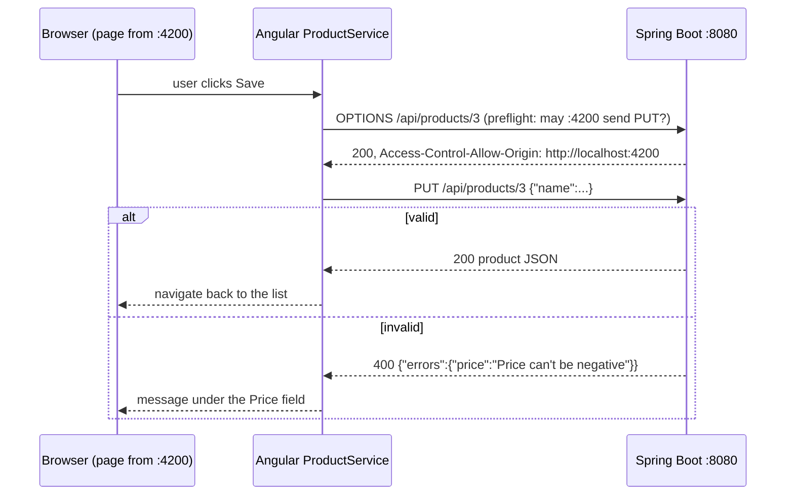

# 06 — Full-Stack: Angular + Spring Boot

> A product-inventory app in two parts that work together: a Spring Boot REST API and an Angular frontend. They run side by side, the API on `:8080` and the UI on `:4200`, and the browser connects them.

**Before this:** [03-spring-boot](../03-spring-boot) for the backend half. No earlier stage covers Angular; the frontend README explains each piece as it's used.

## Why this stage
Everything so far was tested with curl, Postman and MockMvc. A browser adds its own rules and needs:
- **CORS:** a page may only read responses from its own origin unless the server allows it;
- **JSON keys** that match the frontend's model;
- **errors** a form can show next to the right field;
- **status codes** the UI can react to.

This stage builds both sides, so you see each of these from both ends.

## Run it (JDK 21 and Node 20+)
Two terminals:
```bash
cd product-service-backend && ./mvnw spring-boot:run          # API on http://localhost:8080 (H2 + sample data)
cd product-inventory-frontend && npm ci && npx ng serve       # UI on http://localhost:4200
```
Open http://localhost:4200: list, search, create, edit and delete products.

Tests, neither of which needs the other side running:
```bash
cd product-service-backend && ./mvnw test                     # 6 tests
cd product-inventory-frontend && npx ng test --watch=false    # 12 tests
```

| # | Project | Topics |
| --- | --- | --- |
| 1 | [product-service-backend](./product-service-backend) | REST paths, Spring Data JPA search, validation, `ProblemDetail`, **CORS** |
| 2 | [product-inventory-frontend](./product-inventory-frontend) | Angular 21 standalone components, router, `HttpClient`, signals (zoneless), reactive forms, Vitest |

## How a request travels


## Suggested study order
1. **product-service-backend:** run it and call it with curl, including the `OPTIONS` preflight in its README.
2. **product-inventory-frontend:** read `product.service.ts`, then the list and form components.
3. **Break it on purpose:** stop the backend, or change `app.cors.allowed-origins` to another port. The UI shows the "cannot reach" message, and the browser console shows the CORS error.

## Quick revision checklist
- [ ] What is an origin, and why does the browser block `localhost:4200` → `localhost:8080` without CORS?
- [ ] What is a preflight request, and when does the browser send one?
- [ ] Why does the same call work in Postman when it fails in the browser?
- [ ] Which HTTP status should each CRUD operation return (200 / 201 / 204 / 400 / 404)?
- [ ] How do Java getter names become JSON keys (`getPName()` → `"pname"`)?
- [ ] Where do app-wide providers go in a standalone Angular app?
- [ ] Why does a zoneless app keep its state in signals? What do `computed` and `update` do?
- [ ] Why validate in both the form and the backend?
- [ ] What does status 0 mean in an Angular `HttpErrorResponse`?
- [ ] How do you test a component without HTTP, and a service without a server?
- [ ] Why run `npm ci` rather than `npm install` on a fresh clone?
