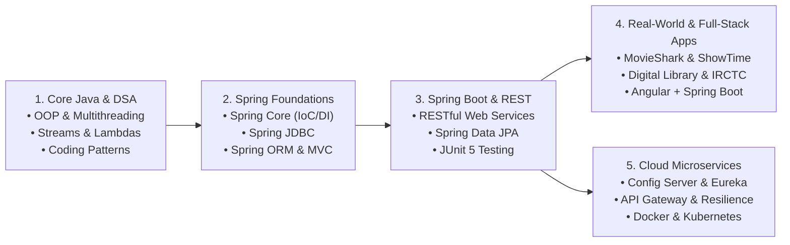
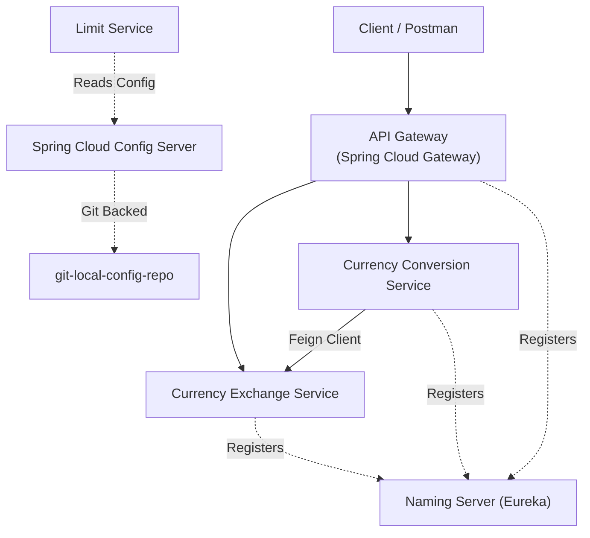

# 🚀 Java, Spring Ecosystem & Full-Stack Engineering Workspace

[](https://openjdk.org/)
[](https://spring.io/projects/spring-framework)
[](https://spring.io/projects/spring-boot)
[](https://spring.io/projects/spring-cloud)
[](https://hibernate.org/)
[](https://angular.dev/)
[](https://www.docker.com/)
[](https://maven.apache.org/)
[](https://gradle.org/)
[](https://junit.org/junit5/)

Welcome to the **Spring Framework & Full-Stack Java Workspace** by **Aditya R. Chauhan**.  
This repository is a comprehensive collection of **21 hands-on projects and modules** progressing from **Core Java, Functional Programming, and DSA Patterns** to **Spring Foundations (Core, JDBC, ORM, MVC)**, **Spring Boot REST APIs**, **Full-Stack Angular + Spring Boot Applications**, and **Spring Cloud Microservices with Docker & Kubernetes**.

---

## 🗺️ Learning & Architecture Roadmap



---

## 📂 Repository Catalog (By Category)

### 1️⃣ Spring Framework Foundations
Core modules demonstrating how Spring works under the hood before moving to auto-configuration.

| Project Folder | Tech Stack | Key Concepts & Features |
| :--- | :--- | :--- |
| [**`springcore`**](./springcore) | Spring Core, Maven, XML/Annotations | IoC Container, Dependency Injection (Constructor/Setter), Bean Lifecycle, Stereotype Annotations (`@Component`, `@Autowired`), SpEL, and Standalone Collections. |
| [**`springjdbc`**](./springjdbc) | Spring JDBC, MySQL, Maven | Database operations using `JdbcTemplate`, `RowMapper` implementations, DAO design pattern, XML & Java-based (`@Configuration`) setup. |
| [**`spring_orm`**](./spring_orm) | Spring ORM, Hibernate, Maven | Integration of Spring with Hibernate ORM (`HibernateTemplate`), entity persistence, declarative transaction management (`@Transactional`). |
| [**`springmvc`**](./springmvc) | Spring Web MVC, JSP, Tomcat 10.1 | MVC architecture with `DispatcherServlet`, `HomeController` & `ContactController`, form handling (`@ModelAttribute`), `UserService` + `UserDao` layer, and JSP views (`index`, `contact`, `about`, `help`, `success`). |
| [**`Servers`**](./Servers) | Apache Tomcat v10.1 | Local server runtime configurations (`server.xml`, `context.xml`, `web.xml`, `tomcat-users.xml`) for deploying Spring MVC web applications. |

---

### 2️⃣ Spring Boot, RESTful APIs, JPA & Unit Testing
Modern Spring Boot services using embedded servers, Spring Data JPA, and automated testing.

| Project Folder | Tech Stack | Key Concepts & Features |
| :--- | :--- | :--- |
| [**`Spring_Boot_Hands_On`**](./Spring_Boot_Hands_On) | Spring Boot, Spring Data JPA, REST | Contains **`Rest_first`** — a Book Management REST API featuring `BookController`, `BookService`, DAO repository layer, and CRUD endpoints (`GET`, `POST`, `PUT`, `DELETE`). |
| [**`restful-web-services`**](./restful-web-services) | Spring Boot 3, Spring Web, Validation | RESTful web services (`HelloWorldController`, `UserResource`, `UserDaoService`), path variables, HTTP status codes, exception handling, and URI building. |
| [**`jpa-hibernate-hands-on-udemy`**](./jpa-hibernate-hands-on-udemy) | Spring Boot, Spring Data JPA, H2/MySQL | Entity mapping, `EntityManager`, Spring Data JPA repositories, custom queries, and relational persistence hands-on exercises. |
| [**`junit_in_5_steps_Adi`**](./junit_in_5_steps_Adi) | Java, JUnit 5 (Jupiter) | Unit testing fundamentals (`MyMaths` & `MyMathsTest`), assertions (`assertEquals`, `assertTrue`), and test lifecycle annotations. |

---

### 3️⃣ Spring Cloud Microservices & Containerization
Distributed systems architecture featuring centralized configuration, service discovery, API routing, and container orchestration.



| Project Folder | Sub-Modules Included | Description |
| :--- | :--- | :--- |
| [**`limit-service-microservices`**](./limit-service-microservices) | • `limit-service-microservices`<br>• `spring-cloud-config-server`<br>• `git-local-config-repo`<br>• `naming-server` (Eureka)<br>• `api-gateway`<br>• `currency-exchange-service`<br>• `currency-conversion-service` | Complete hands-on Spring Cloud microservices suite with environment-specific profiles (`dev`, `qa`), Eureka service discovery, Feign declarative REST clients, and Spring Cloud Gateway routing. |
| [**`spring-microservices-v3`**](./spring-microservices-v3) | • `02.restful-web-services`<br>• `03.microservices`<br>• `04.docker` & `91.docker`<br>• `05.kubernetes`<br>• `97.new-features` | Comprehensive Spring Boot 3 & Spring Cloud reference workspace including step-by-step microservices evolution, Dockerfiles, `docker-compose` setups, and Kubernetes deployment manifests. |

---

### 4️⃣ Real-World Backend & Full-Stack Applications
Production-style capstone projects and full-stack Angular + Spring Boot applications.

| Project Folder | Tech Stack | Project Overview & Highlights |
| :--- | :--- | :--- |
| [**`movieshark`**](./movieshark) | Spring Boot, JPA, MySQL, Postman | **MovieShark Ticket Booking System** — Backend platform for movies, theaters, shows, seats, and user reviews. Includes system design notes ([`design.txt`](./movieshark/design.txt)) and ready-to-import Postman collection ([`MovieShark.postman_collection.json`](./movieshark/MovieShark.postman_collection.json)). |
| [**`SpringBoot_Projects`**](./SpringBoot_Projects) | Spring Boot, Gradle/Maven, Docker Compose | Houses two major capstone projects:<br>1. **`digitalLibrary`** (Gradle) — Digital Library management system with requirement specs.<br>2. **`showtime`** (Maven + Docker) — Movie/Event booking service with [`docker-compose.yml`](./SpringBoot_Projects/showtime/docker-compose.yml) and [`Showtime.postman_collection.json`](./SpringBoot_Projects/showtime/Showtime.postman_collection.json). |
| [**`showtime`**](./showtime) | Java, Maven | Workspace build module companion for the ShowTime booking application. |
| [**`IRCTC_Ticket_Booking`**](./IRCTC_Ticket_Booking) | Java, Gradle (`9.1`), Jackson | **IRCTC Train Ticket Booking Application** — Train search, seat booking, ticket cancellation, and user authentication service built with Gradle wrapper. |
| [**`productservice_angular`**](./productservice_angular) | Spring Boot, Spring Data JPA, REST | **Product Inventory Backend API** — Provides RESTful CRUD endpoints (`ProductController`, `ProductService`, `ProductRepository`, `Product` model) consumed by the Angular frontend. |
| [**`Angular_Bootcamp`**](./Angular_Bootcamp) | Angular CLI, TypeScript, HTML/SCSS | **Product Inventory Frontend (`productinventory`)** — Single-Page Application (SPA) built with Angular that integrates with `productservice_angular`. |

---

### 5️⃣ Core Java, Functional Programming & DSA Interview Prep
Foundational computer science, Java 8+ functional idioms, multithreading, and coding interview patterns.

| Project Folder | Topics Covered | Highlights |
| :--- | :--- | :--- |
| [**`Interview_Practice`**](./Interview_Practice) | • **DSA Coding Patterns** (`cracking-the-coding-interview_DSA_Patterns`)<br>• **Java 8+ Streams & Lambdas** | • **Chapter 1 (Arrays & Strings)**: Sort Colors, Subarray problems<br>• **Chapter 2 (Linked Lists)**: Remove Duplicates, Custom `LinkedListNode`<br>• **Fast & Slow Pointers**: Linked List Cycle detection, Middle of Linked List<br>• **Kadane's Algorithm**: Maximum Subarray Sum<br>• **Sliding Window** & **Stream API / Lambda Threads** (`ThreadDemo`, `StreamMain1`). |
| [**`Functional-programming-Rnga-with-Java`**](./Functional-programming-Rnga-with-Java) | Java 8+ Functional Programming | Structured vs. Functional paradigms (`FP01Structured`, `FP01Functional`, `FP01Exercise`) and null-safe design with `Optional` (`PlayingWithOptional`). |
| [**`Head_First_Java_Hands_On`**](./Head_First_Java_Hands_On) | Core Java, OOP, Collections, Exceptions | Hands-on implementations from *Head First Java* & interview prep: Real-world OOP Abstraction (`PaymentService`, `UPIPayment`, `CreditCardPayment`, `OrderService`), Checked vs. Unchecked Exceptions, `HashMap` / `ArrayList` internals, and Stream phone-number filtering. |
| [**`Complete_Java_Fullstack_Youtube_Lovepreet`**](./Complete_Java_Fullstack_Youtube_Lovepreet) | Java Networking & Concurrency | Contains **`Multithreaded_Web_Server`** demonstrating socket programming and concurrent client handling in Java. |

---

## ⚡ Getting Started & Running the Projects

### Prerequisites
- **Java Development Kit (JDK)**: `17` or `21+`
- **Build Tools**: Apache Maven (`3.8+`) & Gradle (or use the included `./mvnw` and `./gradlew` wrappers)
- **Database**: MySQL `8.x` (for JDBC/ORM/MovieShark/ShowTime) or in-memory H2
- **Node.js & Angular CLI**: Node `18+` and `@angular/cli` (for `Angular_Bootcamp/productinventory`)
- **IDE**: Eclipse IDE for Enterprise Java & Web Developers / Spring Tool Suite (STS) / IntelliJ IDEA

---

### 1. Running a Spring Boot Project (Maven)
Navigate into any Spring Boot directory (e.g., `Spring_Boot_Hands_On/Rest_first/Rest_first`, `movieshark`, `productservice_angular`, or `restful-web-services/restful-web-services`) and run:

```bash
# Using the included Maven Wrapper (Windows)
.\mvnw.cmd spring-boot:run

# Using the included Maven Wrapper (macOS / Linux)
./mvnw spring-boot:run
```

### 2. Running the Spring Cloud Microservices Suite
To run the full microservices ecosystem inside [`limit-service-microservices`](./limit-service-microservices), start the services in the following order:

1. **Spring Cloud Config Server** (`limit-service-microservices/spring-cloud-config-server/spring-cloud-config-server`) — Port `8888`
2. **Eureka Naming Server** (`limit-service-microservices/naming-server/naming-server`) — Port `8761` (Dashboard at `http://localhost:8761`)
3. **Domain Services**:
   - `limit-service-microservices` (Port `8080`)
   - `currency-exchange-service` (Port `8000`)
   - `currency-conversion-service` (Port `8100`)
4. **API Gateway** (`limit-service-microservices/api-gateway/api-gateway`) — Port `8765`

### 3. Running the Full-Stack Angular + Spring Boot App
**Step 1 — Start the Spring Boot Backend:**
```bash
cd productservice_angular
.\mvnw.cmd spring-boot:run
```

**Step 2 — Start the Angular Frontend:**
```bash
cd Angular_Bootcamp/productinventory
npm install
ng serve --open
```
Then open `http://localhost:4200` in your browser.

### 4. Testing APIs with Postman
Ready-to-use Postman collections are included in the repository:
- **MovieShark API**: [`movieshark/MovieShark.postman_collection.json`](./movieshark/MovieShark.postman_collection.json)
- **ShowTime API**: [`SpringBoot_Projects/showtime/Showtime.postman_collection.json`](./SpringBoot_Projects/showtime/Showtime.postman_collection.json)

---

## 👨‍💻 Author

**Aditya R. Chauhan**  
- GitHub: [@adityachauhan564](https://github.com/adityachauhan564)
