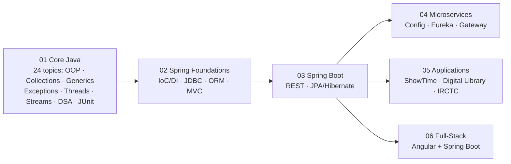

# 🚀 Java, Spring & Full-Stack Learning Workspace

My hands-on learning path, from **Core Java and DSA**, through **Spring internals** and **Spring Boot REST APIs**, to **Spring Cloud microservices** and a **full-stack Angular + Spring Boot** app.

The folders are numbered in the order to study them. Each numbered folder has a README with a study order and a revision checklist. Each project has a README with **What it teaches → Run it → Read the code in this order → Revision notes → Status**.



---

## 📂 Repository map

| Stage | Folder | Projects |
| :--- | :--- | :--- |
| 1 | [`01-core-java`](./01-core-java) | [head-first-java](./01-core-java/head-first-java) · [functional-programming](./01-core-java/functional-programming) · [dsa-interview-practice](./01-core-java/dsa-interview-practice) · [multithreaded-web-server](./01-core-java/multithreaded-web-server) · [junit-basics](./01-core-java/junit-basics) |
| 2 | [`02-spring-foundations`](./02-spring-foundations) | [spring-core](./02-spring-foundations/spring-core) · [spring-jdbc](./02-spring-foundations/spring-jdbc) · [spring-orm](./02-spring-foundations/spring-orm) · [spring-mvc](./02-spring-foundations/spring-mvc) |
| 3 | [`03-spring-boot`](./03-spring-boot) | [rest-first-books-api](./03-spring-boot/rest-first-books-api) · [restful-web-services](./03-spring-boot/restful-web-services) · [jpa-hibernate](./03-spring-boot/jpa-hibernate) |
| 4 | [`04-microservices`](./04-microservices) | [spring-cloud-config-server](./04-microservices/spring-cloud-config-server) · [naming-server](./04-microservices/naming-server) · [limits-service](./04-microservices/limits-service) · [currency-exchange-service](./04-microservices/currency-exchange-service) · [currency-conversion-service](./04-microservices/currency-conversion-service) · [api-gateway](./04-microservices/api-gateway) |
| 5 | [`05-applications`](./05-applications) | [showtime](./05-applications/showtime) · [movieshark](./05-applications/movieshark) · [digital-library](./05-applications/digital-library) · [irctc-ticket-booking](./05-applications/irctc-ticket-booking) |
| 6 | [`06-fullstack-angular`](./06-fullstack-angular) | [product-service-backend](./06-fullstack-angular/product-service-backend) · [product-inventory-frontend](./06-fullstack-angular/product-inventory-frontend) |
| — | [`reference`](./reference) | [in28minutes-spring-microservices-v3](./reference/in28minutes-spring-microservices-v3): the course's own code, kept for comparison (not my work) |

### Status at a glance
- ✅ **Everything compiles.** Every Maven and Gradle project builds on JDK 21, and the Angular tests pass.
- ✅ **Verified running:**
  - `head-first-java`: all 24 topics, 37 programs, including the `assert` self-checks (`java -ea`)
  - `restful-web-services` (in-memory data, Swagger)
  - `jpa-hibernate` (H2)
  - `spring-core` examples
  - `multithreaded-web-server` step 1
  - the `digital-library` and `irctc` unit tests
- 🚧 **Work in progress:**
  - `spring-orm`, `irctc-ticket-booking` and the Angular frontend are unfinished tutorial steps.
  - `currency-exchange-service` and `currency-conversion-service` are skeletons: their controllers were never committed. Their READMEs point to the complete versions under `reference/` to compare against.
- 📝 **Stubs:** three `dsa-interview-practice` files marked `// TODO: not implemented yet` (`sortColours`, `LinkedList_Cycle`, `MiddleOfLinkedList`) are problem statements, not solutions.

---

## ⚡ Getting started

### Prerequisites
- **JDK 21**. The Boot 2.7 apps also work on JDK 17.
- **Maven**: use the `./mvnw` wrapper when a project has one. For the `02-spring-foundations` projects use `mvn` or any sibling project's wrapper with `-f`.
- **Gradle**: use the included `./gradlew`.
- **MySQL 8** for the JDBC, MVC and Boot apps that use it. **Redis** for digital-library.
- **Node 18+** for the Angular app.

### Credentials: environment variables, never in git
Projects that need a database read it from environment variables:

```bash
# macOS / Linux / Git Bash
export DB_USERNAME=root DB_PASSWORD=your-password
# PowerShell
$env:DB_USERNAME="root"; $env:DB_PASSWORD="your-password"
```

Mail (showtime/movieshark, optional): `MAIL_USERNAME`, `MAIL_PASSWORD`.

### Run a Spring Boot project
```bash
cd 03-spring-boot/restful-web-services
./mvnw spring-boot:run          # Windows: .\mvnw.cmd spring-boot:run
```

### Run the microservices
Start them in the order given in [`04-microservices/README.md`](./04-microservices/README.md): config server (8888), then naming server (8761), then the services, then the gateway (8765).

### Run plain Java examples (no build file)
```bash
cd 01-core-java/head-first-java
javac -d out $(find src -name "*.java")
java -ea -cp out topic11_strings.StringBasics      # any topicNN_<name>.<Class>

cd ../dsa-interview-practice
javac -d out $(find cracking-the-coding-interview_DSA_Patterns -name "*.java")
java -ea -cp out kadane.MaximumSubarray
```

### Opening in Eclipse / IntelliJ
IDE files (`.project`, `.classpath`, `.settings/`, `.idea/`) are no longer tracked.
- **Maven/Gradle projects:** import them as existing Maven/Gradle projects.
- **Plain Java projects:** create a Java project on the folder and mark `src` as the source folder.
- **junit-basics:** also add the JUnit 5 library.

---

## 🧠 How to revise quickly
1. Open a stage's README and work through its **Quick revision checklist**.
2. For any item you can't explain, open that project's README and read its **Revision notes**.
3. Then follow **Read the code in this order**, and run the project to see it work.

New to Java? Start with [head-first-java](./01-core-java/head-first-java): it has 24 numbered topics, a beginner reading path through them, and a revision checklist for each topic.

---

## 🙏 Credits
- Course material: in28minutes (Spring Boot, JPA, Microservices, Functional Programming), Head First Java, and other courses named in each project README.
- [`reference/in28minutes-spring-microservices-v3`](./reference/in28minutes-spring-microservices-v3) is a copy of [in28minutes/spring-microservices-v3](https://github.com/in28minutes/spring-microservices-v3).

## 👨‍💻 Author
**Aditya R. Chauhan**. GitHub: [@adityachauhan564](https://github.com/adityachauhan564)
