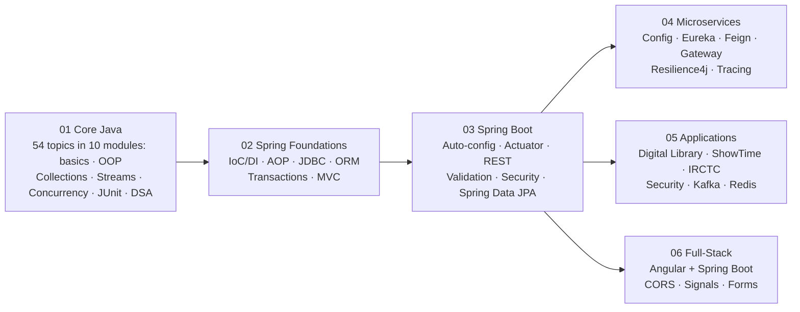

# 🚀 Java, Spring & Full-Stack Learning Workspace

A step-by-step path from **your first Java program** to **Spring Boot REST APIs**, **Spring Cloud microservices** and a **full-stack Angular + Spring Boot app**. Every topic has code you can run, a README that explains *why* before *how*, and a revision checklist.

> **Made for:** college students, freshers and anyone revising Java and Spring for interviews.
> **You need:** only **JDK 21** for almost everything (plus **Node 20+** for the Angular app). No database or server to install: the projects use an in-memory database with sample data.

---

## 📑 Contents
1. [Start in 5 minutes](#-start-in-5-minutes)
2. [The learning path](#-the-learning-path)
3. [What is inside each stage](#-what-is-inside-each-stage)
4. [Prerequisites](#-prerequisites)
5. [How to run the projects](#-how-to-run-the-projects)
6. [Running the tests](#-running-the-tests)
7. [Optional: MySQL, Redis, Kafka and email](#-optional-mysql-redis-kafka-and-email)
8. [How every README is organised](#-how-every-readme-is-organised)
9. [How to revise quickly](#-how-to-revise-quickly)
10. [Common problems and fixes](#-common-problems-and-fixes)
11. [Project status](#-project-status)
12. [Credits](#-credits)

---

## ⚡ Start in 5 minutes

**1. Check that Java 21 is installed.**
```bash
java -version          # should print: java version "21..." (or openjdk version "21...")
```
If it prints an older version or "not recognized", see [Common problems](#-common-problems-and-fixes).

**2. Get the code.**
```bash
git clone https://github.com/adityachauhan564/spring-framework.git
cd spring-framework
```

**3. Run something.** Pick whichever matches where you are:

| I want to... | Run this (Git Bash) |
| :--- | :--- |
| start learning Java from zero | `cd 01-core-java/01-java-basics && javac -d out $(find . -name "*.java") && java -cp out topic01_first_program.HelloWorld` |
| see Spring create objects for me | `cd 02-spring-foundations && ./mvnw -q -pl spring-core compile exec:java -Dexec.mainClass=com.springcore.topic01_why_spring.ContainerWiringDemo` |
| run a REST API | `cd 03-spring-boot/restful-web-services && ./mvnw spring-boot:run`, then open http://localhost:8080/users |

On Windows PowerShell, use `.\mvnw.cmd` instead of `./mvnw`. The Java commands are different in PowerShell; [How to run the projects](#-how-to-run-the-projects) shows both.

---

## 🧭 The learning path

The folders are numbered in the order to study them. Each stage builds on the one before it. After stage 03, stages 04, 05 and 06 don't depend on each other, so you can take them in any order.


```mermaid
flowchart LR
    A["01 Core Java<br/>54 topics in 10 modules: basics · OOP<br/>Collections · Streams · Concurrency · JUnit · DSA"] --> B["02 Spring Foundations<br/>IoC/DI · AOP · JDBC · ORM<br/>Transactions · MVC"]
    B --> C["03 Spring Boot<br/>Auto-config · Actuator · REST<br/>Validation · Security · Spring Data JPA"]
    C --> D["04 Microservices<br/>Config · Eureka · Feign · Gateway<br/>Resilience4j · Tracing"]
    C --> E["05 Applications<br/>Digital Library · ShowTime · IRCTC<br/>Security · Kafka · Redis"]
    C --> F["06 Full-Stack<br/>Angular + Spring Boot<br/>CORS · Signals · Forms"]
```

| Stage | You will learn | You are ready when you can... |
| :--- | :--- | :--- |
| [01 Core Java](./01-core-java) | Java syntax, OOP, collections, streams, threads, JUnit, Maven, DSA basics | write a small program with classes, lists and maps, and test it |
| [02 Spring Foundations](./02-spring-foundations) | Spring **without** Boot: the IoC container, dependency injection, AOP, JDBC, Hibernate, web MVC | explain what Spring creates for you and how objects get connected |
| [03 Spring Boot](./03-spring-boot) | Auto-configuration, REST API design, validation, security, Spring Data JPA, testing | build a CRUD REST API with proper status codes and tests |
| [04 Microservices](./04-microservices) | Central config, service discovery, load balancing, an API gateway, fault tolerance, tracing | run six services together and follow one request through them |
| [05 Applications](./05-applications) | Three complete backends: relationships, caching, security, safe concurrent booking, Kafka | design a small real-world backend from start to end |
| [06 Full-Stack](./06-fullstack-angular) | An Angular frontend talking to a Spring Boot API, and CORS | connect a browser app to your API and explain the CORS errors |

---

## 📂 What is inside each stage

| Stage | Projects |
| :--- | :--- |
| [`01-core-java`](./01-core-java) | 54 topics in order: [01 Java basics](./01-core-java/01-java-basics) · [02 Objects and classes](./01-core-java/02-objects-and-classes) · [03 OOP](./01-core-java/03-oop) · [04 Collections and generics](./01-core-java/04-collections-and-generics) · [05 Streams](./01-core-java/05-streams) · [06 Concurrency](./01-core-java/06-concurrency) · [07 Java APIs](./01-core-java/07-java-apis) · [08 Advanced Java](./01-core-java/08-advanced-java) · [09 Testing and build](./01-core-java/09-testing-and-build) · [10 DSA](./01-core-java/10-dsa) |
| [`02-spring-foundations`](./02-spring-foundations) | [spring-core](./02-spring-foundations/spring-core) · [spring-jdbc](./02-spring-foundations/spring-jdbc) · [spring-orm](./02-spring-foundations/spring-orm) · [spring-mvc](./02-spring-foundations/spring-mvc) |
| [`03-spring-boot`](./03-spring-boot) | [spring-boot-basics](./03-spring-boot/spring-boot-basics) · [restful-web-services](./03-spring-boot/restful-web-services) · [jpa-hibernate](./03-spring-boot/jpa-hibernate) · [rest-first-books-api](./03-spring-boot/rest-first-books-api) |
| [`04-microservices`](./04-microservices) | [spring-cloud-config-server](./04-microservices/spring-cloud-config-server) · [naming-server](./04-microservices/naming-server) · [limits-service](./04-microservices/limits-service) · [currency-exchange-service](./04-microservices/currency-exchange-service) · [currency-conversion-service](./04-microservices/currency-conversion-service) · [api-gateway](./04-microservices/api-gateway) |
| [`05-applications`](./05-applications) | [digital-library](./05-applications/digital-library) · [showtime](./05-applications/showtime) · [irctc-ticket-booking](./05-applications/irctc-ticket-booking) |
| [`06-fullstack-angular`](./06-fullstack-angular) | [product-service-backend](./06-fullstack-angular/product-service-backend) · [product-inventory-frontend](./06-fullstack-angular/product-inventory-frontend) |
| [`reference`](./reference) | [in28minutes-spring-microservices-v3](./reference/in28minutes-spring-microservices-v3): the course's own code, kept only for comparison (not my work) |

**Main versions:** Java 21 · Spring Framework 6.2 (stage 02) · Spring Boot 4.0 (stages 03-06) · Spring Cloud 2025.1 (stage 04) · Hibernate 6.6 (stage 02) and 7 (Boot projects) · Angular 21 · JUnit 5 · Maven and Gradle 9.1 (through the included wrappers).

---

## ✅ Prerequisites

| Tool | Needed for | How to check | Notes |
| :--- | :--- | :--- | :--- |
| **JDK 21** | everything | `java -version` and `javac -version` | Must be 21 or newer. A JRE alone is not enough: you need `javac` too. |
| **Git** | getting the code | `git --version` | On Windows, Git also gives you **Git Bash**, which runs every command in this README. |
| **Node 20+** and npm | only the Angular app (stage 06) | `node -v` | Tested with Node 22. |
| **Docker** | only the optional extras | `docker version` | For MySQL, Redis, Kafka and Mailpit. Never required. |

**Maven and Gradle are already included.** Each project has a wrapper script (`./mvnw` or `./gradlew`). The first run downloads the right version by itself, so you don't install either one.

---

## 🏃 How to run the projects

There are four kinds of project here. Each project's README has its exact commands; this section is the general pattern.

### 1. Core Java topics (plain Java, no build tool)
Compile one whole module, then run any class in it.

```bash
# Git Bash / macOS / Linux
cd 01-core-java/01-java-basics
javac -d out $(find . -name "*.java")
java -cp out topic04_control_flow.LoopTypes          # any topicNN_<name>.<Class>
java -cp out topic04_control_flow.Exercises          # then try the exercises
```
```powershell
# Windows PowerShell
cd 01-core-java/01-java-basics
javac -d out (Get-ChildItem -Recurse -Filter *.java).FullName
java -cp out topic04_control_flow.LoopTypes
```
Module `09-testing-and-build` is the only exception: it is a Maven project (`./mvnw test`). [The Core Java README](./01-core-java/README.md) explains every step in detail.

### 2. Spring projects built with Maven (stages 02-04, showtime, the full-stack backend)
```bash
cd 03-spring-boot/restful-web-services
./mvnw spring-boot:run          # Windows: .\mvnw.cmd spring-boot:run
```
Stop the app with `Ctrl+C`. Stages 02, 03 and 04 also have one wrapper at the stage folder that builds and tests all their projects together: `./mvnw verify`.

### 3. Spring projects built with Gradle (digital-library, irctc-ticket-booking)
```bash
cd 05-applications/digital-library
./gradlew bootRun               # Windows: .\gradlew.bat bootRun
```

### 4. The six microservices together (stage 04)
```bash
cd 04-microservices
./start-all.sh                  # Windows PowerShell: .\start-all.ps1
./stop-all.sh                   # Windows PowerShell: .\stop-all.ps1
```
The script builds all six services, starts them in the right order (config server → naming server → services → gateway), and waits until each one is ready. [The microservices README](./04-microservices/README.md) then walks you through every pattern with the system running.

### 5. The full-stack app (stage 06)
Use two terminals, because both halves run at the same time:
```bash
cd 06-fullstack-angular/product-service-backend && ./mvnw spring-boot:run      # API on :8080
cd 06-fullstack-angular/product-inventory-frontend && npm ci && npx ng serve   # UI on :4200
```
Then open http://localhost:4200.

### Using an IDE (Eclipse / IntelliJ)
IDE files (`.project`, `.classpath`, `.settings/`, `.idea/`) are not kept in git, so set the project up once:
- **Maven or Gradle projects:** import them as an existing Maven or Gradle project.
- **Core Java modules:** create a Java project on a module folder (for example `01-core-java/03-oop`), with that folder itself as the source folder. Import `09-testing-and-build` as a Maven project.

Then right-click a class that has a `main` method and choose *Run*.

---

## 🧪 Running the tests

None of these needs a database, a broker or another service running.

| Stage | Command (run from the folder shown) | Tests |
| :--- | :--- | :--- |
| 01 | `01-core-java/09-testing-and-build`: `./mvnw test` | 21 run, 4 skipped on purpose (your exercises) |
| 02 | `02-spring-foundations`: `./mvnw verify` | 43 |
| 03 | `03-spring-boot`: `./mvnw verify` | 37 |
| 04 | `04-microservices`: `./mvnw verify` | 14 |
| 05 | `digital-library`: `./gradlew test` · `irctc-ticket-booking`: `./gradlew test` · `showtime`: `./mvnw test` | 17 · 6 · 17 |
| 06 | `product-service-backend`: `./mvnw test` · `product-inventory-frontend`: `npx ng test --watch=false` | 6 · 12 |

The Core Java topics outside module 09 check themselves: each `Exercises.java` tells you which exercise is still unsolved when you run it.

---

## 🐳 Optional: MySQL, Redis, Kafka and email

Every project works without these. Turn them on through a Spring **profile** (a named set of settings) when you want to see the real thing. Docker runs each one in a container, and removing the container leaves nothing behind on your machine.

| Extra | Used by | How to turn it on |
| :--- | :--- | :--- |
| **MySQL 8** | spring-jdbc, spring-orm, spring-mvc, rest-first-books-api, digital-library, showtime, product-service-backend | `mysql` profile, or `DB_URL` for the stage 02 projects |
| **Redis** | digital-library | `redis` profile (`docker compose up -d` in that folder) |
| **Kafka + Mailpit** | showtime | `kafka,mail` profiles (`docker compose up -d` in that folder) |

Examples:
```bash
./mvnw spring-boot:run -Dspring-boot.run.profiles=mysql            # Maven projects
./gradlew bootRun --args='--spring.profiles.active=redis'          # Gradle projects
```

**Passwords come from environment variables, never from git.** Set them before you start a project that uses MySQL:
```bash
# Git Bash / macOS / Linux
export DB_USERNAME=root DB_PASSWORD=your-password
# Windows PowerShell
$env:DB_USERNAME="root"; $env:DB_PASSWORD="your-password"
```
For showtime with a real mail server (not Mailpit), also set `MAIL_USERNAME` and `MAIL_PASSWORD`. Locally, Mailpit needs neither.

---

## 📘 How every README is organised

You never have to guess where to look. Each level has its own README:

| Level | Example | What it gives you |
| :--- | :--- | :--- |
| **Stage** | [`03-spring-boot/README.md`](./03-spring-boot/README.md) | what the stage covers, how to run it, the study order, and a **Quick revision checklist** |
| **Project** | [`03-spring-boot/restful-web-services/README.md`](./03-spring-boot/restful-web-services/README.md) | why it matters, how to run it, **Read the code in this order**, **Revision notes**, and its status |
| **Core Java topic** | [`01-core-java/01-java-basics/topic04_control_flow`](./01-core-java/01-java-basics/topic04_control_flow) | **Key concepts**, **Common mistakes**, the files to run, and exercises with solutions |

The code comments use the same simple style as the READMEs. In the topic-based projects (stages 01-03), each demo class starts with a short header: the topic, the key idea, how to run it, and something to try.

---

## 🧠 How to revise quickly
1. Open a stage README and go through its **Quick revision checklist**.
2. For any item you can't explain, open the linked project or topic README and read its **Revision notes** (in Core Java: **Key concepts** and **Common mistakes**).
3. Follow **Read the code in this order** (in Core Java: the **Run it** list), and run the code to see it work.
4. In Core Java, finish with the topic's `Exercises.java`.

New to Java? Start with [01 Core Java](./01-core-java): 54 topics in study order, each with a why-first README, runnable examples, exercises with solutions, and a revision checklist.

---

## 🐛 Common problems and fixes

| What you see | Why | Fix |
| :--- | :--- | :--- |
| `'javac' is not recognized` or `java: command not found` | The JDK is not installed, or not on your PATH | Install JDK 21, set `JAVA_HOME` to its folder, and add its `bin` folder to PATH. Open a **new** terminal and check `java -version` again. |
| `UnsupportedClassVersionError ... class file version 65.0` | The code was built with Java 21, but an older Java is running it | Make sure `java -version` shows 21, in the same terminal. |
| `File not found - *.java` in PowerShell | `$(find ...)` is Git Bash syntax. In PowerShell, `find` is a different Windows tool | Use the PowerShell command shown in [Core Java topics](#1-core-java-topics-plain-java-no-build-tool), or switch to Git Bash. |
| `running scripts is disabled on this system` | PowerShell blocks `.ps1` scripts by default | `powershell -ExecutionPolicy Bypass -File .\start-all.ps1` (this changes nothing permanently). |
| `Port 8080 was already in use` | Another app (often a project you started earlier) is still running | Stop it with `Ctrl+C` in its terminal. Most projects use port 8080, so run one at a time. |
| The first `./mvnw` or `./gradlew` is slow | The wrapper is downloading Maven or Gradle and the libraries, once | Wait for it. Later runs are fast. |

Each project README has more fixes for its own topics. [The Core Java README](./01-core-java/README.md) has a full troubleshooting section for beginners.

---

## 📊 Project status

- ✅ **Everything builds.** Every Maven and Gradle project builds on JDK 21, and the Angular app builds.
- ✅ **Verified running:**
  - `01-core-java`: all 54 topics. Every example and exercise solution runs, and every unsolved `Exercises.java` fails as it should. Module 09's Maven build passes 17 JUnit tests (4 more are your exercises, skipped until you write them).
  - `02-spring-foundations`: all 4 projects (30 topics) run with no database or server installed. `./mvnw verify` passes 43 tests, and the MVC app was checked over real HTTP on Jetty.
  - `03-spring-boot`: all 4 projects run with no database or server installed. `./mvnw verify` passes 37 tests, and every API was checked over real HTTP.
  - `04-microservices`: all 6 services start with one script (`start-all.sh` / `.ps1`), and `./mvnw verify` passes 14 tests. Config refresh, load balancing, Feign and RestClient calls, gateway routes, Resilience4j and tracing were checked from start to end.
  - `05-applications`: all 3 projects run with no database or broker installed (40 tests). digital-library was checked with Redis, and showtime with Kafka and Mailpit, in Docker.
  - `06-fullstack-angular`: the API and the Angular app work together with no database installed (6 + 12 tests), checked in a headless browser across origins.
  - **MySQL modes:** every project that has one (spring-jdbc, spring-orm, spring-mvc, rest-first-books-api, digital-library, showtime, product-service-backend) was run against MySQL 8.4 in a throwaway Docker container, including keeping data across a restart.

---

## 🙏 Credits
- Course material: in28minutes (Spring Boot, JPA, Microservices, Functional Programming), Head First Java, GeeksforGeeks JBDL (digital-library, showtime), and the other courses named in each project README.
- [`reference/in28minutes-spring-microservices-v3`](./reference/in28minutes-spring-microservices-v3) is a copy of [in28minutes/spring-microservices-v3](https://github.com/in28minutes/spring-microservices-v3).

## 👨‍💻 Author
**Aditya R. Chauhan**. GitHub: [@adityachauhan564](https://github.com/adityachauhan564)
