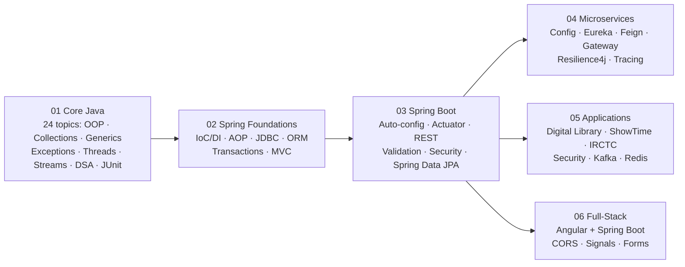

# 🚀 Java, Spring & Full-Stack Learning Workspace

My hands-on learning path, from **Core Java and DSA**, through **Spring internals** and **Spring Boot REST APIs**, to **Spring Cloud microservices** and a **full-stack Angular + Spring Boot** app.

The folders are numbered in the order to study them. Each numbered folder has a README with a study order and a revision checklist. Each project has a README that explains **why it matters, how to run it, the order to read the code, revision notes and its status**. The topic-based projects in stages 01-03 put the *why* in each topic.

Every Spring project runs with **only JDK 21** (plus Node for the Angular app): databases default to in-memory H2 with sample data, and MySQL, Redis, Kafka and mail are optional extras.


```mermaid
flowchart LR
    A["01 Core Java<br/>24 topics: OOP · Collections · Generics<br/>Exceptions · Threads · Streams · DSA · JUnit"] --> B["02 Spring Foundations<br/>IoC/DI · AOP · JDBC · ORM<br/>Transactions · MVC"]
    B --> C["03 Spring Boot<br/>Auto-config · Actuator · REST<br/>Validation · Security · Spring Data JPA"]
    C --> D["04 Microservices<br/>Config · Eureka · Feign · Gateway<br/>Resilience4j · Tracing"]
    C --> E["05 Applications<br/>Digital Library · ShowTime · IRCTC<br/>Security · Kafka · Redis"]
    C --> F["06 Full-Stack<br/>Angular + Spring Boot<br/>CORS · Signals · Forms"]
```

---

## 📂 Repository map

| Stage | Folder | Projects |
| :--- | :--- | :--- |
| 1 | [`01-core-java`](./01-core-java) | [head-first-java](./01-core-java/head-first-java) · [functional-programming](./01-core-java/functional-programming) · [dsa-interview-practice](./01-core-java/dsa-interview-practice) · [multithreaded-web-server](./01-core-java/multithreaded-web-server) · [junit-basics](./01-core-java/junit-basics) |
| 2 | [`02-spring-foundations`](./02-spring-foundations) | [spring-core](./02-spring-foundations/spring-core) · [spring-jdbc](./02-spring-foundations/spring-jdbc) · [spring-orm](./02-spring-foundations/spring-orm) · [spring-mvc](./02-spring-foundations/spring-mvc) |
| 3 | [`03-spring-boot`](./03-spring-boot) | [spring-boot-basics](./03-spring-boot/spring-boot-basics) · [restful-web-services](./03-spring-boot/restful-web-services) · [jpa-hibernate](./03-spring-boot/jpa-hibernate) · [rest-first-books-api](./03-spring-boot/rest-first-books-api) |
| 4 | [`04-microservices`](./04-microservices) | [spring-cloud-config-server](./04-microservices/spring-cloud-config-server) · [naming-server](./04-microservices/naming-server) · [limits-service](./04-microservices/limits-service) · [currency-exchange-service](./04-microservices/currency-exchange-service) · [currency-conversion-service](./04-microservices/currency-conversion-service) · [api-gateway](./04-microservices/api-gateway) |
| 5 | [`05-applications`](./05-applications) | [digital-library](./05-applications/digital-library) · [showtime](./05-applications/showtime) · [irctc-ticket-booking](./05-applications/irctc-ticket-booking) |
| 6 | [`06-fullstack-angular`](./06-fullstack-angular) | [product-service-backend](./06-fullstack-angular/product-service-backend) · [product-inventory-frontend](./06-fullstack-angular/product-inventory-frontend) |
| — | [`reference`](./reference) | [in28minutes-spring-microservices-v3](./reference/in28minutes-spring-microservices-v3): the course's own code, kept for comparison (not my work) |

### Status at a glance
- ✅ **Everything compiles.** Every Maven and Gradle project builds on JDK 21, and the Angular app builds and its tests pass.
- ✅ **Verified running:**
  - `head-first-java`: all 24 topics, 37 programs, including the `assert` self-checks (`java -ea`)
  - `functional-programming`: all 15 topics, including the `assert` self-checks
  - `02-spring-foundations`: all 4 projects (30 topics) run with no database or server installed, and `./mvnw verify` passes 43 tests; the MVC app was checked over real HTTP on Jetty
  - `03-spring-boot`: all 4 projects run with no database or server installed, and `./mvnw verify` passes 37 tests; every API was checked over real HTTP
  - `04-microservices`: all 6 services start with one script (`start-all.sh` / `.ps1`), and `./mvnw verify` passes 14 tests; config refresh, load balancing, Feign and RestClient calls, gateway routes, Resilience4j and tracing were checked end to end
  - `05-applications`: all 3 projects run with no database or broker installed (40 tests); digital-library was checked with Redis, and showtime with Kafka and Mailpit, in Docker
  - `06-fullstack-angular`: the API and the Angular app work together with no database installed (6 + 12 tests); checked in a headless browser across origins
  - `multithreaded-web-server` step 1
- 📝 **Stubs:** three `dsa-interview-practice` files marked `// TODO: not implemented yet` (`sortColours`, `LinkedList_Cycle`, `MiddleOfLinkedList`) are problem statements, not solutions.

---

## ⚡ Getting started

### Prerequisites
- **JDK 21**: every project targets it.
- **Maven**: use the `./mvnw` wrapper included with the projects. Stages 02, 03 and 04 also have one wrapper at the stage root that builds and tests all their projects (`./mvnw verify`).
- **Gradle**: use the included `./gradlew` (digital-library and irctc-ticket-booking, Gradle 9.1).
- **MySQL 8** is optional: the Spring projects default to in-memory H2, and their READMEs show how to switch to MySQL where it is supported. **Docker** is needed only for the optional Redis (digital-library) and Kafka/Mailpit (showtime) modes.
- **Node 20+** for the Angular app.

### Credentials: environment variables, never in git
Projects that need a database read it from environment variables:

```bash
# macOS / Linux / Git Bash
export DB_USERNAME=root DB_PASSWORD=your-password
# PowerShell
$env:DB_USERNAME="root"; $env:DB_PASSWORD="your-password"
```

Mail for showtime with a real SMTP server (optional): `MAIL_USERNAME`, `MAIL_PASSWORD`. Locally, Mailpit needs neither.

### Run a Spring Boot project
```bash
cd 03-spring-boot/restful-web-services
./mvnw spring-boot:run          # Windows: .\mvnw.cmd spring-boot:run

cd 05-applications/digital-library
./gradlew bootRun               # the Gradle projects: Windows gradlew.bat bootRun
```
Optional profiles switch on the real infrastructure, e.g. `-Dspring-boot.run.profiles=mysql` (Maven) or `--args='--spring.profiles.active=redis'` (Gradle). Each README lists its profiles.

### Run the microservices
```bash
cd 04-microservices
./start-all.sh                  # Windows PowerShell: .\start-all.ps1
./stop-all.sh
```
It builds all six services, starts them in order (config server → naming server → services → gateway) and waits until they're ready. [`04-microservices/README.md`](./04-microservices/README.md) has a walkthrough of every pattern.

### Run the full-stack app
```bash
cd 06-fullstack-angular/product-service-backend && ./mvnw spring-boot:run      # API on :8080
cd 06-fullstack-angular/product-inventory-frontend && npm ci && npx ng serve   # UI on :4200
```
Then open http://localhost:4200. [`06-fullstack-angular/README.md`](./06-fullstack-angular/README.md) explains how the two halves talk (CORS).

### Run plain Java examples (no build file)
```bash
cd 01-core-java/head-first-java
javac -d out $(find src -name "*.java")
java -ea -cp out topic11_strings.StringBasics      # any topicNN_<name>.<Class>

cd ../dsa-interview-practice
javac -d out $(find cracking-the-coding-interview_DSA_Patterns -name "*.java")
java -ea -cp out kadane.MaximumSubarray
```

### Opening in Eclipse / IntelliJ
IDE files (`.project`, `.classpath`, `.settings/`, `.idea/`) are no longer tracked.
- **Maven/Gradle projects:** import them as existing Maven/Gradle projects.
- **Plain Java projects:** create a Java project on the folder and mark `src` as the source folder.
- **junit-basics:** also add the JUnit 5 library.

---

## 🧠 How to revise quickly
1. Open a stage's README and work through its **Quick revision checklist**.
2. For any item you can't explain, open that project's README and read its **Revision notes**.
3. Then follow **Read the code in this order**, and run the project to see it work.

New to Java? Start with [head-first-java](./01-core-java/head-first-java): it has 24 numbered topics, a beginner reading path through them, and a revision checklist for each topic.

---

## 🙏 Credits
- Course material: in28minutes (Spring Boot, JPA, Microservices, Functional Programming), Head First Java, GeeksforGeeks JBDL (digital-library, showtime), and other courses named in each project README.
- [`reference/in28minutes-spring-microservices-v3`](./reference/in28minutes-spring-microservices-v3) is a copy of [in28minutes/spring-microservices-v3](https://github.com/in28minutes/spring-microservices-v3).

## 👨‍💻 Author
**Aditya R. Chauhan**. GitHub: [@adityachauhan564](https://github.com/adityachauhan564)
